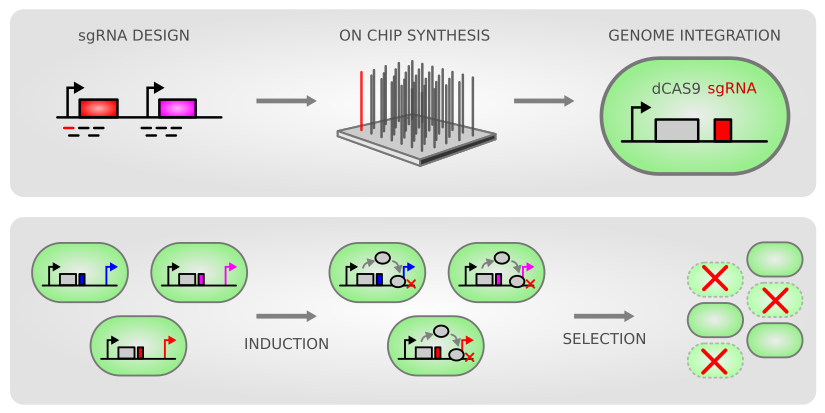

# R-notebook-crispri-lib

<!-- header image -->


### News

**2021-06-22 | Github repository moved**

The original repository `R-notebooks` became too small and too diverse for all library projects.
The CRISPRi library pipelines were therefore moved to this new dedicated repository, `R-notebook-crispri-lib`.

**2021-05-01 | New CRISPRi library available**

Based on the successful first CRISPRi library, a new *Synechocystis sp* PCC 6803 library with at least 5 sgRNAs instead of just 2 was designed and is currently tested. The library is available to researchers on request (michael.jahn@scilifelab.se, paul.hudson@scilifelab.se).

**2021-02-08 | Pipeline for automatic CRISPRi lib data processing**

A new pipeline for automated analysis of NGS data of PCR amplified sgRNAs is [available on Github](https://github.com/m-jahn/CRISPRi-lib-pipe). The pipeline uses the popular `DESeq2` package to estimate depletion and enrichment ('fitness') of sgRNA repression mutants.

**2020-04-03 | CRISPRi library paper published**

Our paper was published as [Pooled CRISPRi screening of the cyanobacterium Synechocystis sp PCC 6803 for enhanced industrial phenotypes](https://www.nature.com/articles/s41467-020-15491-7) in Nature Communications!
The preprint is available at [BioRxiv.org](https://www.biorxiv.org/content/10.1101/823534v2).

### Related publications

1. The second, new CRISPRi library in cyanobacteria with more sgRNAs per target is currently prepared for publication.
2. The first CRISPRi library in cyanobacteria was published in [Yao et al., Nature Communications, 2020](https://www.nature.com/articles/s41467-020-15491-7). 
The preprint is available at [BioRxiv.org](https://www.biorxiv.org/content/10.1101/823534v2).


### Overview

This repository contains data processing pipelines for the analysis of **CRISPRi repression library** data. The experiments were primarily carried out in the model cyanobacterium *Synechocystis sp.* PCC 6803. The repository contains raw data, processed data and R notebooks (`*.Rmd`) for:

- Next generation sequencing (NGS) of CRISPRi repression mutants
- NGS transcriptomics of knock-out mutants or wild type
- physiological measurements such as growth rate, cell pigmentation

All care was taken to guarantee scientific accuracy and adhere to good scientific practice in terms of statistics, reproducibility and code documentation. Please report any errors by filing a [github issue](https://github.com/m-jahn/R-notebook-crispri-lib/issues) for this repository, or contact michael.jahn@scilifelab.se.

### Contents

- `docs`- rendered pipelines in `html` format
  - [_Synechocystis_ CRISPRi library data processing](https://m-jahn.github.io/R-notebook-crispri-lib/CRISPRi_library_data_processing.nb.html)
  - [_Synechocystis_ CRISPRi library enrichment analysis](https://m-jahn.github.io/R-notebook-crispri-lib/CRISPRi_library_enrichment_analysis.nb.html)
  - [_Synechocystis_ CRISPRi library additional tests](https://m-jahn.github.io/R-notebook-crispri-lib/CRISPRi_library_additional_tests.nb.html)
  - [_Synechocystis_ CRISPRi library V2 data processing](https://m-jahn.github.io/R-notebook-crispri-lib/CRISPRi_V2_data_processing.nb.html)
  - [_Synechocystis_ CRISPRi library V2 machine learning](https://m-jahn.github.io/R-notebook-crispri-lib/CRISPRi_V2_machine_learning.nb.html)
- `sgRNA_library` - *Synechocystis* CRISPRi library Version 1 ([Yao et al., 2020](https://www.nature.com/articles/s41467-020-15491-7))
  - `figures` - exported figures from pipelines
  - `pipeline` - data processing pipelines, R markdown format (`.Rmd`)
  - `processed_data` - directory containing the output data
  - `raw_data` - directory containing the input
- `sgRNA_library_V2` - *Synechocystis* CRISPRi library Version 2 (*in preparation*)
  - `data` - directory containing the input and output data
  - `figures` - exported figures from pipelines
  - `pipeline` - data processing pipelines, R markdown format (`.Rmd`)

### How to run the pipelines

The pipelines collected in this repository are self-contained and executable. The code _and_ the documentation are part of one and the same R markdown document for each pipeline. Pipelines can be downloaded and executed from the `pipeline` sub-folders. To simply view the rendered pipelines follow the links to the `*.html` reports at [Contents](#Contents).

To download the repository on your local drive use `git clone` in a (linux) terminal:

``` bash
cd /your-target-folder
git clone https://github.com/m-jahn/R-notebook-crispri-lib.git
```

Open a pipeline with Rstudio and execute code (chunks) with the `Run` button.
Alternatively, open an interactive R session and render the R markdown pipeline:

``` bash
require(rmarkdown)
rmarkdown::render("pipeline.Rmd")
```
