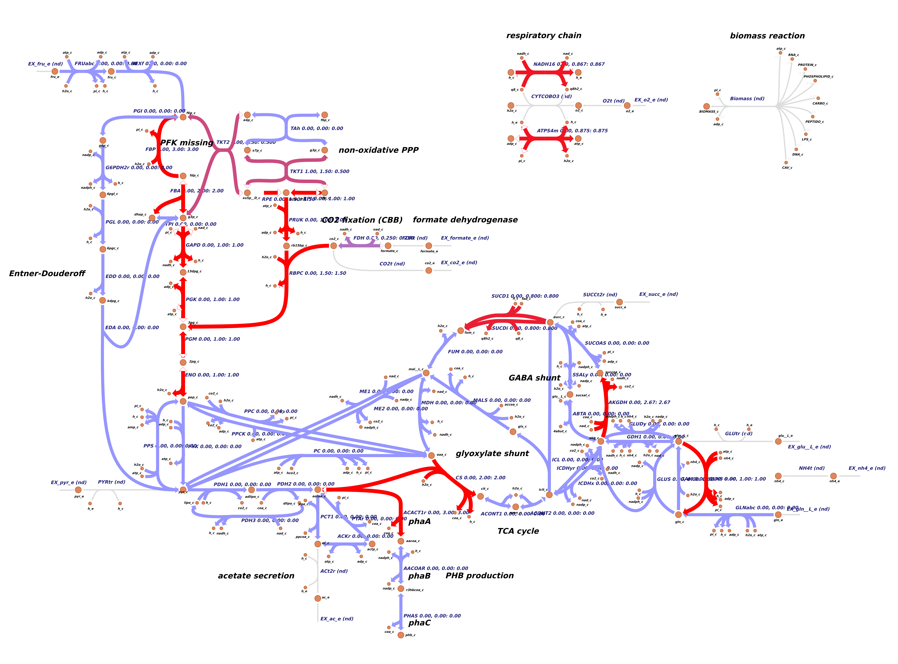

## Description

This R notebook is a bioinformatics pipeline for the analysis of gene essentiality in the chemolithoautotroph *Ralstonia eutropha* (a.k.a. *Cupriavidus necator*). Two different sources are used to investigate gene essentiality. 

The **first source** is the genome scale model (GEM) of *R. eutropha* published by Park et al., 2011. The model was further manually corrected, curated, and annotated by Dr. Michael Jahn and the most recent version in SBML V3 standard can be accessed on  [github.com/m-jahn](https://github.com/m-jahn/genome-scale-models). The gene essentiality was analyzed using the very versatile `COBRApy` package for python, and the functions are documented on [github.com/m-jahn](https://github.com/m-jahn/genome-scale-models/blob/master/Ralstonia_eutropha/essentiality_analysis.py) as well.

The **second source** is a set of BarSeq experiments, where a library of barcoded transposon insertion mutants was cultivated in different media, and then sequenced. Analogously to the CRISPRi library in *Synechocystis sp.* PCC 6803 (see [Yao et al., Nature Communications, 2020](https://www.nature.com/articles/s41467-020-15491-7), or my  [R notebooks on github](https://github.com/m-jahn/R-notebooks)), the sequencing will reveal the quantity of each tansposon mutant before and after competetive cultivation in a specific growth medium. If mutants disappear over time, the gene that was hit by the transposon is essential for this condition. For example, if a library of mutants is cultivated using formic acid as a substrate, transposon mutants where insertion happened in a formate dehydrogenase are likely to be more depleted than mutants hit in a neutral region. 

In this notebook I only include data from a non-selective medium (LB medium) that the library was initially cultivated in. It contains all amino acids and other biomolecules originating from yeast/protein hydrolysate. This `complete` medium supplies cells with many ready-made biomolecules so that only a minimal set of genes becomes really essential.

## Data import

```{r, message = FALSE}
# loading libraries
library(lattice)
library(latticeExtra)
library(tidyverse)
library(Rtools)
library(stringi)
```

Import essentiality data from:

 - genome scale model (1 table)
 - BarSeq summary (2 tables)

```{r, message = FALSE, warning = FALSE}
# load model predictions for gene essentiality
df_model <- read_csv("../data/model_gene_essentiality.csv") %>% select(-X1)

# load BarSeq data with gene essentiality for the initial Tn-library (in LB medium)
df_barseq_LB <- read_tsv("../data/barseq_gene_essentiality_LB.tab")
```

-----

## Essentiality for complete medium predicted by model and BarSeq

### Processing and summarizing data

The first step is to merge the two data sources and bring them into a coherent format. We perform a left join which will omit all genes from BarSeq data that are not present in the model. Before that, we have to deal with the problem of ambiguity of locusTags between `classicID` (2006 sequencing, original annotation) and new `locusID` (re-annotation of gene loci). The problem that arises is that one `classicID` often spans more than one of the new loci. A simple but not probably not very clean solution is to keep only the one classicID and map it to the strictest verdict from BarSeq (`unhit` takes precedence over `uncertain`, and then `lowbar`)

```{r}
# remove duplicated classic locusTags in BarSeq data before joining
df_barseq_LB <- df_barseq_LB %>% group_by(ClassicID) %>%
  arrange(desc(Essentiality %>% as.factor)) %>%
  slice(1)
  
df_lb <- left_join(
  df_model %>% select(gene, contains("reaction_"), LB_medium), 
  df_barseq_LB, 
  by = c("gene" = "ClassicID"))

head(df_lb)
```

-----

The BarSeq data contains the following three categories: 1) `Unhit` for genes that we're confident do not have transposon insertions (these are very likely `essential`). 2) `Lowbar` for genes that were not `Unhit` but have too low read counts. 3) `Uncertain` for genes that neither are non-essential nor fit the categories above (mostly these `Uncertain` genes are too short to determine whether they are missing insertions just by chance). All other genes present in the model (or in *R. eutropha* in general) can be reagrded as `non-essential`.


To get the full picture, we need to summarize genes by the following categories. These categories are chosen from the persepctive of the model being the hpyothesis, and the BarSeq data the experimental proof

  - not essential in model, not in barseq (TRUE NEGATIVE)
  - essential in model, but not in barseq (FALSE POSITIVE)
  - not essential in model, but in barseq (FALSE NEGATIVE)
  - essential in model, and in barseq     (TRUE POSITIVE)

To obtain a summary of these categories, we simply fill up model genes with no counterpart in the LB BarSeq table with a `non-essential` label. This is a fair assumption because the BarSeq data covers virtually all genes. Genes without or very few transposon mutants (even for statistical reasons like short gene lenght) are covered in the LB BarSeq table, and all others have mutants and are therefore `non-essential` in LB.


```{r}
df_lb <- df_lb %>%
  
  # add 'non-essential' label and replace unhit with essential
  mutate(Essentiality = Essentiality %>% 
    replace_na("non-essential") %>%
    recode(
      Unhit = "essential", 
      Uncertain = "probably essential", 
      Lowbar = "probably essential"
    )
  )
  
# group by Essentiality and summarize model scores
df_summary <- df_lb %>% 
  # remove duplicated genes that participate in 
  # several reactions
  filter(!duplicated(gene)) %>%
  group_by(Essentiality) %>%
  summarize(
    model_essential = sum(LB_medium),
    model_non_essential = sum(LB_medium == 0)
  ) %>%
  
  # turn column into row names
  column_to_rownames("Essentiality")

print(df_summary)
```

-----

#### Summary

The genome scale model predicts that `r sum(df_summary$model_essential)` genes out of `r nrow(df_model)` are essential, and the BarSeq data confirms that for the majority (**true positives**), `r df_summary["essential", "model_essential"]` genes, or `r df_summary["essential", "model_essential"]/sum(df_summary$model_essential) * 100` % of predicted essential genes). The number of **false positives** from the perspective of the model is therefore `r df_summary["non-essential", "model_essential"]` genes, or `r df_summary["non-essential", "model_essential"]/sum(df_summary$model_essential) * 100` % of predicted essential genes.

On the other hand, the model counts `r sum(df_summary$model_non_essential)` genes as non-essential, of which `r df_summary["non-essential", "model_non_essential"]` genes, or `r df_summary["non-essential", "model_non_essential"]/sum(df_summary$model_non_essential) * 100` % are confirmed by BarSeq data as **true negatives**. The **false negatives** sum up to `r df_summary["essential", "model_non_essential"]` genes, or `r df_summary["essential", "model_non_essential"]/sum(df_summary$model_non_essential) * 100` %.


-----

### Model essential genes/reactions

To further curate the model and incorporate findings from BarSeq experiments, it is interesting to look at the genes classified as **false positives and false negatives**. We can assume that all LB essential genes are the core essential genes. To have a closer look on the reactions catalyzed by the LB essential genes (both true and false positives), the corresponding model reactions for all genes were already included in the imported table `df_model` and `df_lb`. 

While there is overlap between essentiality as judged by the model and by experimental validation, there are also discrepancies. The model can yield false positive essentiality as a consequence of enzymes (or subunits thereoff) that catalyze an essential reaction, while in reality this reaction can be catalyzed by other isoenzymes or enzyme complexes.

On the other hand, genes that the model does not regard as essential but BarSeq confirmed they are, are false negatives. Here, the underlying cause can be that the model annotates reactions with several isoenzymes while in reality only one is the key enzyme. Also, the `COBRApy` essentiality analysis only counts genes as essential if a knockout shows no growth at all. It does not take **beneficial** or **partially deleterious** knock outs into account. This is e.g. very good evidence to further curate reactions in the GEM. 


```{r, fig.width = 8, fig.height = 10}
df_essential <- df_lb %>% 
  
  # select only model essential genes
  filter(LB_medium == 1) %>%
  
  # group by reaction and summarize n enzymes
  group_by(reaction_name) %>%
  mutate(n_enzymes = length(unique(gene))) %>%
  
  # order by number of subunits
  ungroup %>%
  arrange(desc(n_enzymes), reaction_name)

# summary table
head(df_essential)

# plot model essential reactions
plot_model_essential <- barchart(
  reaction_name %>% substr(1,45) %>% factor(., rev(unique(.))) ~ LB_medium,
  df_essential %>% group_by(reaction_name) %>%
    filter(!duplicated(gene)) %>% ungroup %>% slice(1:61),
  groups = Essentiality %>% factor(., unique(.)), 
  par.settings = custom.lattice(),
  col = c("#FF4800", "#F79400", "#E6DE4A"),
  stack = TRUE, 
  main = "model essential genes (top 50 reactions ordered by subunits)",
  xlim = c(0, 16), xlab = "# enzymes/subunits",
  panel = function(x, y, ...) {
    panel.grid(h = -1, v = -1, col = grey(0.9))
    panel.barchart(x, y, ...)
    panel.key(..., pch = 15, corner = c(0.97, 0.95))
  }
)

print(plot_model_essential)
```

It turns out that only few reactions are multi-subunit reactions where all annotated genes are required (`AND` rule). Regarding the false-positive reactions (`non-essential` genes by BarSeq) it is likely that there are un-annotated isoenzymes in _R. eutropha_ that can take over functionality. Or the GEM makes wrong assumptions about essentiality of the particular reaction.

-----

### Model non-essential genes/reactions

We repeat the same process as above for the non-essential genes in the model. This is only interesting for one purpose, analyzing the **false-negative** genes, i.e. the ones that are non-essential according to the model but not according to BarSeq. We quantify reactions with a large number of false-negative genes.

```{r, fig.width = 8, fig.height = 10}
df_non_essential <- df_lb %>% 
  
  # select only model non-essential genes
  filter(LB_medium == 0) %>%
  
  # group by reaction and summarize number of (probably) essential enzymes
  group_by(reaction_name) %>% 
  arrange(reaction_id) %>%
  filter(!duplicated(gene)) %>%
  mutate(
    n_enzymes = length(gene),
    n_essential = sum(Essentiality %in% c("essential", "probably essential"))
  ) %>%
  
  # order by number of subunits
  ungroup %>%
  arrange(desc(n_essential), reaction_name)

# summary table
head(df_non_essential)

# plot top model non-essential reactions; 
# unspecific reactions (many of associated subunits/isoenzymes) are removed.
# We achieve this by allowing only reactions with at least 25 % essential genes
plot_model_non_essential <- barchart(
  reaction_name %>% substr(1,45) %>% factor(., rev(unique(.))) ~ LB_medium+1,
  df_non_essential %>% filter(n_essential/n_enzymes >= 0.25) %>% 
    filter(!reaction_id %in% c("NADH5", "NADH16", "SUCDi")) %>% slice(1:160),
  groups = Essentiality %>% factor(., unique(.)), 
  par.settings = custom.lattice(), 
  col = c("#FF4800", "#F79400", "#E6DE4A"),
  stack = TRUE, 
  main = "model non-essential genes (top 50 reactions ordered by subunits)",
  xlim = c(0, 16), xlab = "# enzymes/subunits",
  panel = function(x, y, ...) {
    panel.grid(h = -1, v = -1, col = grey(0.9))
    panel.barchart(x, y, ...)
    panel.key(..., pch = 15, corner = c(0.97, 0.95))
  }
)

print(plot_model_non_essential)
```

There are at least 25 reactions catalyzed by **two ore more subunits or associated genes** that are essential according to BarSeq data, but not in the model. These are reactions where at least 25 % of the annotated genes are essential according to BarSeq. The most likely explanation for discrepancies between *in silico* and *in vivo* essentiality is that `gene_reaction_rule` associations in the model are formulated as isoenzymes (`gene_1 OR gene_2`) instead of enzyme complexes (`gene_1 AND gene_2`). These reactions can be curated in the model with the help of external databases such as Kegg and Uniprot. In clear cases where BarSeq data and databases agree, gene association can be changed to `AND` rule.

```{r, include = FALSE}
# export figures
svg(filename = "../figures/model_essential_genes.svg", width = 16, height = 10)
print(plot_model_essential, split = c(1,1,2,1), more = TRUE)
print(plot_model_non_essential, split = c(2,1,2,1))
dev.off()
```

----------

### Overlay essentiality information on metabolic network

To get an overview about gene essentiality as predicted by the genome scale model, and as determined using BarSeq experimental data, we can overlay both types of information on the `Escher` map of the core metabolic network. AS with reactions, Escher takes a `*.csv` file as input with gene IDs in the first column and either one or two extra columns with experimental values. Here, the experimental values are simply model predictions for essentiality in one column and essentiality determined by BarSeq in the next, using binary encoding (`0 = non-essential`, `1 = essential`). `Probably essential` is counted as essential for the time being.

The encoding was chosen because Escher's data overlay for gene expression uses the fold change by default. First, gene expression values are aggregated per reaction and then the relative difference is color-coded. Example: for an arbitrary reaction the difference in essentiality is calculated as `dE = abs(mean(E_model_gene_A, E_model_gene_B) - mean(E_barseq_gene_A, E_barseq_gene_B))`.

```{r}
# simplify the master data frame to one gene per row, and 
# remove all unnecessary columns
df_lb %>% filter(!duplicated(gene)) %>%
  
  # gene ID, model prediction, BarSeq experiment
  select(gene, LB_medium, Essentiality) %>%
  
  # recode categories to binary
  mutate(Essentiality = Essentiality %>% recode(
    `non-essential` = 0, 
    `essential` = 1,
    `probably essential` = 1
    )
  ) %>%
  
  # rename columns for clarity
  rename(model = LB_medium, barseq = Essentiality) %>%
  
  # export as csv
  write_csv("../data/escher_gene_essentiality.csv")
```

----------

After loading the latest map of the *R. eutropha* core metabolic network in `Escher`, the exported essentiality information was overlaid using the `Data` --> `Load gene data` menu and the result plotted as `.svg` and `*.png` files.

```{r, fig.width = 10, fig.height = 5, out.width = "100%", fig.align = 'center'}
# load result from Escher overlay

```

### Detailed analysis of selected essential reactions

Some of the reactions that have several essential genes associated (BarSeq) turned out to be non-essential according to the model. At first impression it is surprising that some of the annotated genes turn out as essential in BarSeq, when they are actually *iso-enzymes*, not *subunits* (`OR` instead of `AND` concatenation).

The following section sheds some light on selected reactions that have several essential **isoenzymes**. This is a contradiction as isoenzymes should be able to compensate for each others.

```{r, fig.width = 7, fig.height = 4}
df_selected_reactions <- df_lb %>%
  
  # filter data for selected reactions
  filter(reaction_id %in% c("RBPC", "PRUK", "RPE", "TKT1")) %>%
  
  # order by reaction and essentiality
  mutate(Essentiality = Essentiality %>% factor(., unique(.)[c(1,3,2)])) %>%
  arrange(reaction_id, as.numeric(Essentiality))

plot_selected <- barchart(
  paste(reaction_id, "\n", reaction_name) ~ rep(1, length(reaction_id)),
  df_selected_reactions,
  groups = Essentiality,
  par.settings = custom.lattice(),
  box.width = 0.3, stack = TRUE,
  col = c("#FF4800", "#F79400", "#E6DE4A"),
  main = "selected reactions with iso-enzymes",
  xlim = c(0, 5), xlab = "# enzymes/subunits",
  gene = df_selected_reactions$gene,
  panel = function(x, y, gene = gene, ...) {
    panel.grid(h = -1, v = -1, col = grey(0.9))
    # add text labels to plot
    y_coor =  as.numeric(factor(y))
    x_coor = unlist(sapply(table(y_coor), function(x) 1:x))
    panel.barchart(x, y, ...)
    panel.text(x_coor-0.5, y_coor, labels = gene, cex = 0.75, col = grey(0.1))
    panel.key(..., pch = 15, corner = c(0.97, 0.05))
  }
)

print(plot_selected)
```

```{r, include = FALSE}
# export figures
svg(filename = "../figures/model_selected_genes.svg", width = 7, height = 4)
print(plot_selected)
dev.off()
```


### Conclusions

- There is **very good overlap** between model predictions of essentiality and BarSeq data
- **70.3 % of model-essential genes** are also essential by BarSeq (71 out of 101)
- The biggest error of model predictions are false negatives (161 genes falsely predicted to be non-essential)
- Reasons for this are first and foremost: model counts only zero growth phenotype as essential (fatal mutant)
- This could be adressed by simulating if KOs are **beneficial but not essential for growth**
- Second most important reason could be that isoenzymes are falsely annotated (model uses alternative gene/isoenzyme that doesn't work in reality, or not at the same rate)
- Several of the BarSeq predictions were used to correct obvious errors in enzyme stoichiometry in the GEM (`AND` rule instead of `OR` rule)


