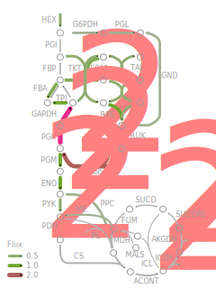
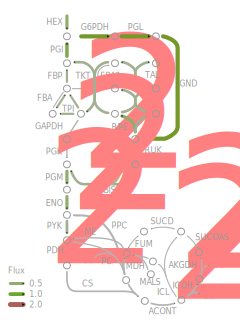

----------

# Description

This R notebook details the data processing and visualization for growth competition experiments with a CRISPRi sgRNA library. The library contains around 20,000 unique sgRNA repression mutants tailored for the cyanobacterium _Synechocystis_ sp. PCC6803. This library is the second version (therefore "V2") of an sgRNA library for _Synechocystis_, containing five instead of only two sgRNAs per gene. In some cases, genes or ncRNAs are so short that it is not possible to design a maximum of five individual sgRNAs.

The first iteration of the _Synechocystis_ sgRNA library was [published in Nature Communications, 2020](https://www.nature.com/articles/s41467-020-15491-7).

# Prerequisites

Load required packages.

```{r, message = FALSE }
suppressPackageStartupMessages({
  library(tidyverse)
  library(ggrepel)
  library(lattice)
  library(latticeExtra)
  library(latticetools)
  library(scales)
  library(dendextend)
  library(vegan)
  library(tsne)
  library(KEGGREST)
  library(limma)
  library(corrplot)
  library(kableExtra)
  library(grid)
  library(ggpubr)
})
```

Define global figure style, default colors, and a plot saving function.

```{r, echo = FALSE}
# custom ggplot2 theme that is reused for all later plots
custom_colors = c("#E7298A", "#66A61E", "#E6AB02", "#7570B3", "#B3B3B3", "#1B9E77", "#D95F02", "#A6761D")
custom_range <- function(n = 5) {colorRampPalette(custom_colors[c(1,5,2)])(n)}

custom_theme <- function(base_size = 12, base_line_size = 1.0, base_rect_size = 1.0, ...) {
  theme_light(base_size = base_size, base_line_size = base_line_size, base_rect_size = base_rect_size) + theme(
    title = element_text(colour = grey(0.4), size = 10),
    plot.margin = unit(c(12,12,12,12), "points"),
    axis.ticks.length = unit(0.2, "cm"),
    axis.ticks = element_line(colour = grey(0.4), linetype = "solid", lineend = "round"),
    axis.text.x = element_text(colour = grey(0.4), size = 10),
    axis.text.y = element_text(colour = grey(0.4), size = 10),
    panel.grid.major = element_line(size = 0.6, linetype = "solid", colour = grey(0.9)),
    panel.grid.minor = element_blank(),
    panel.border = element_rect(linetype = "solid", colour = grey(0.4), fill = NA, size = 1.0),
    panel.background = element_blank(),
    strip.background = element_blank(),
    strip.text = element_text(colour = grey(0.4), size = 10, margin = unit(rep(3,4), "points")),
    legend.text = element_text(colour = grey(0.4), size = 10),
    legend.title = element_blank(),
    legend.background = element_blank(),
    ...
  )
}

# set graphical parameter for subfigure labels
list_fontpars <- list(face = "plain", size = 14)

# function to export an image as svg and png
save_plot <- function(pl, path = "../figures/", width = 6, height = 6) {
  pl_name <- deparse(substitute(pl))
  svg(filename = paste0(path, pl_name, ".svg"),
    width = width, height = height)
  print(pl)
  dev.off()
  png(filename = paste0(path, pl_name, ".png"),
    width = width*125, height = height*125, res = 120)
  print(pl)
  invisible(capture.output(dev.off()))
}
```


# Quality control

## Data import

Load raw data. The main table contains already normalized quantification of all sgRNAs, fold change, multiple hypothesis corrected p-values, and fitness scores on the guide RNA and gene level. Contrary to the processing of [our first CRISPRi library V1](https://github.com/m-jahn/R-notebook-crispri-lib#contents), much of the functionality from the notebook was transferred into a new [NExtflow CRISPRi library pipeline](https://github.com/m-jahn/nf-core-crispriscreen) available on github.

```{r}
load("../data/input/result.Rdata")
df_main <- DESeq_result_table
rm(DESeq_result_table)
```


## Data annotation

Different annotation columns are added to the main data frame, including a short sgRNA identifier (excluding the position on the gene), an sgRNA index (1 to 5), and genome annotation from Uniprot. The Uniprot data is dynamically downloaded for every update of this pipeline using their very simple API (`read_tsv("https://www.uniprot.org/uniprot/?query=taxonomy:1111708&format=tab")`). The full list of columns that can be queried is available [here](https://www.uniprot.org/help/uniprotkb_column_names).
Pathway annotation from KEGG is later in the pipeline added using the `KEGGREST` package.

```{r, message = FALSE}
df_main <- df_main %>%
  group_by(sgRNA_target) %>%
  mutate(sgRNA_type = if_else(grepl("^nc_", sgRNA), "ncRNA", "gene")) %>%
  ungroup %>%
  
  # map trivial names to LocusTags using a manually curated list
  left_join(
    read_tsv("../data/input/mapping_trivial_names.tsv", col_types = cols()),
    by = c("sgRNA_target" = "gene")) %>%

  # split condition into separate cols
  separate(condition, into = c("carbon", "light", "treatment_1", "treatment_2"),
    sep = ", ", remove = FALSE, fill = "right") %>%
  unite("treatment", treatment_1, treatment_2, sep = ", ", na.rm = TRUE)
```

Overview about the different conditions.

```{r}
df_cultivation_summary <- df_main %>% group_by(condition) %>%
  summarize(
    time_points = paste(unique(time), collapse = ", "),
    carbon = unique(carbon),
    light = unique(light),
    treatment = unique(treatment),
    min_fit = min(fitness),
    med_fit = median(fitness),
    max_fit = max(fitness))

print(df_cultivation_summary)
write_csv(df_cultivation_summary, file = "../data/output/cultivation_summary.csv")
```

Retrieve gene info from uniprot and merge with main data frame. We need to make a custom function to retrieve and parse the data from uniprot, because of a bug in the security level on Ubuntu 20.04. The fallback option is to load a local copy of uniprot annotation for this organism.

```{r}
uniprot_url <- paste0(
  "https://rest.uniprot.org/uniprotkb/stream?fields=accession",
  "%2Cid%2Cprotein_name%2Cgene_names%2Corganism_name%2Clength",
  "%2Cgene_oln%2Cgene_primary%2Ccc_pathway%2Cgo_id%2Ccc_subce",
  "llular_location%2Ccc_interaction%2Cxref_kegg&format=tsv&query=%28prote",
  "ome%3AUP000001425%29"
)

get_uniprot <- function(url) {
  df_uniprot <- tryCatch({
      read_tsv(uniprot_url,
        col_types = cols(),
        name_repair = function(x){str_replace_all(tolower(x), "[ \\.]", "_")})
    },
    error = function(server_error) {
      message("Uniprot server not available, falling back on local Uniprot DB copy")
      read_tsv("../data/input/uniprot_synechocystis.tsv", col_types = cols())
    }
  )
}

df_uniprot <- get_uniprot(uniprot_url) %>%
  rename(locus = `kegg`, gene_name = `gene_names`,
    gene_name_short = `gene_names_(primary)`, protein = `protein_names`,
    uniprot_id = `entry`
  ) %>%
  mutate(locus = str_remove_all(locus, "syn:|;$")) %>%
  separate_rows(locus, gene_name_short, sep = ";") %>%
  filter(!is.na(locus), !duplicated(locus))

df_main <- left_join(
  df_main, df_uniprot %>% select(-`gene_names_(ordered_locus)`,
    -`pathway`, -`gene_ontology_ids`, -`interacts_with`),
  by = "locus")
```

## Number of sgRNAs

Each gene is represented by up to five sgRNAs. We can test if all or only some of the 5 sgRNAs are "behaving" in the same way in the same conditions, more mathematically speaking we can estimate the correlation of every sgRNA with another. First let's summarize how many genes have 5, 4, 3 sgRNAs and so on associated with them.

```{r, , fig.width = 6, fig.height = 3.5}
# N unique sgRNAs in dataset
paste0("Number of unique sgRNAs: ", unique(df_main$sgRNA) %>% length)

# N genes with 1,2,3,4 or 5 sgRNAs
plot_sgRNAs_per_gene <- df_main %>%
  group_by(sgRNA_type, sgRNA_target) %>%
  summarize(n_sgRNAs = length(unique(sgRNA_position)), .groups = "drop_last") %>%
  count(n_sgRNAs) %>% filter(n_sgRNAs <= 5) %>%
  ggplot(aes(x = factor(n_sgRNAs, 5:1), y = n, label = n)) +
  geom_col(show.legend = FALSE) +
  geom_text(size = 3, nudge_y = 200, color = grey(0.5)) +
  facet_grid(~ sgRNA_type) +
  labs(x = "sgRNAs / target", y = "targets") +
  coord_cartesian(ylim = c(-50, 3500)) +
  custom_theme()

print(plot_sgRNAs_per_gene)
```

## Fitness distribution of all conditions

Before biological analysis continues, we need to check if fitness (and log2 FC from which it is calculated) is equally distributed. For example, strictly essential genes like ribosomal genes should show the same degreee of depletion over time, regardless of condition.

We can compare fitness over all conditions using a scatter plot matrix. We can see that some conditions are very similar to each other, for example the conditions treated with glucose (`LC, LL +g`, `LC, LL, +D, +G`, `HC, LL +g`). Others are more dissimilar to the rest, for example `LC, IL` and `LC, LL, +FL`. They are more alike each other, although `LC, LL, +FL` should be more comparable to `LC, LL`, hinting at experimental bias. In this case both of these conditions (and `LC, LL, +G`) were pre-cultivated in low light instead of high light, as opposed to the rest of the samples.

```{r, fig.width = 8, fig.height = 8}
df_main %>% filter(time == 0, sgRNA_index == 1) %>%
  select(locus, condition, fitness) %>%
  filter(!is.na(locus)) %>%
  pivot_wider(names_from = condition, values_from = fitness) %>%
  select(-locus) %>%
  custom_splom(pch = 19, cex = 0.3, col = grey(0.4, 0.4), pscales = 0)
```


Another way to look at the result of the normalization is to compare the global distribution of log2 FC values, as a density plot.

```{r, fig.width = 5, fig.height = 6, warning = FALSE}
library(ggridges)
df_main %>% filter(time == 10) %>%
  select(sgRNA, condition, log2FoldChange) %>%
  distinct %>%
  ggplot(aes(x = log2FoldChange, y = condition, group = condition)) + 
  geom_density_ridges(fill = "#00AFBB99", col = grey(0.4)) +
  lims(x = c(-2, 1.5)) +
  custom_theme()
```

# Gene fitness

SgRNA fitness score was calculated as the AUC of log2FC read number over generation time, normalized by generation time. Gene fitness score was calculated as the weighted mean of individual sgRNA fitness scores. The weights are made up of two different components,

  1. guide RNA correlation
  2. guide RNA efficiency


## Guide RNA correlation

A correlation score was calculated by computing the correlation coefficient of all sgRNAs to each other. This score is robustly summarized by taking the median, and rescaling it from the respective minima and maxima [-1, 1] to [0, 1]. This score served as a weight component for each sgRNA to calculate the (global) weighted mean of log2 FC and fitness over all sgRNAs. The score has the characteristic that it gives a weight of 1 for an sgRNA perfectly correlated with all other sgRNAs of the same gene, and a weight of 0 for sgRNAs perfectly anti-correlated to the other sgRNAs.

For a matrix of $x = 1 .. m$ sgRNAs and $y = 1 .. n$ observations (measurements), the correlation $R$ of one sgRNA to another is calculated using Pearson's method:

$R_x=cor([log_2FC_{x1,y1} ... log_2FC_{x1,yn}], [log_2FC_{x2,y1} ... log_2FC_{x2,yn}])$

The correlation weight of one sgRNA is then calculated as median of all $R$ rescaled between 0 and 1.

$w_x = \frac{1 + median(R_1, R_2, ..., R_m)}{2}$

The following example shows the correlation matrix for the 5 `rps10` sgRNAs, and their weights. The self correlation of each sgRNA (R = 1) is removed prior to weight determination.

```{r, fig.width = 4, fig.height = 4}
cor_matrix <- df_main %>% filter(sgRNA_target == "rps10") %>% ungroup %>%
  select(sgRNA_index, log2FoldChange, condition, time) %>%
  pivot_wider(names_from = c("condition", "time"), values_from = log2FoldChange) %>%
  arrange(sgRNA_index) %>% column_to_rownames("sgRNA_index") %>%
  as.matrix %>% t %>% cor(method = "pearson")

weights <- cor_matrix %>% replace(., . == 1, NA) %>%
  apply(2, function(x) median(x, na.rm = TRUE)) %>%
  rescale(from = c(-1, 1), to = c(0, 1))

# plot heatmap
lattice::levelplot(cor_matrix %>% replace(., . == 1, NA),
  col.regions = custom_range(20))

# print weights
weights
```


## Guide RNA efficiency

The correlation of each sgRNA with each other is a "global" parameter as it is identical over all conditions. A second global parameter, **sgRNA efficiency**, was obtained using a similar approach. We expect that fitness of all sgRNAs for one gene is not normally distributed because sgRNAs are not ideal replicate measurements. They are biased by position effects and off-target binding, see [Wang et al., Nature Comms, 2018](https://www.nature.com/articles/s41467-018-04899-x) for a very insightful and comprehensive analysis of the number and position of sgRNAs required to estimate gene fitness.

Here, sgRNA efficiency $E$ was calculated as the median absolute fitness (AUC of log2FC over time) of an sgRNA $x = 1 .. m$ over all observations [conditions] $y = 1 .. n$.

$E_x=median(abs(fitness_{x1, y1}, fitness_{x1, y2}, ..., fitness_{x1, yn}))$

To normalize between all sgRNAs, $E$ is rescaled to a range between 0 and 1.

$E_x=\frac{E_x}{max(E_1, E_2, ..., E_m)}$


This is the resulting sgRNA efficiency for the example gene above, `rps10`.

```{r}
df_main %>% filter(sgRNA_target == "rps10") %>% ungroup %>%
  select(sgRNA_index, sgRNA_efficiency) %>% distinct %>% 
  arrange(sgRNA_index) %>% deframe
```


## Position bias of sgRNA repression

Plot the **weight of each sgRNA** to see if there is a dependency between correlation and sgRNA position. There is no significant trend.

We can also quantify how many genes have strongly correlated sgRNAs and how many have outliers. In order to do this, the median weight of the (up to) 5 sgRNAs per gene is plotted. Generally, the median weight ranges between 0.5 and 1.0, showing on average good correlation.

```{r, fig.width = 6, fig.height = 3}
plot_sgRNA_correlation <- df_main %>%
  select(sgRNA_target, sgRNA_index, sgRNA_correlation, sgRNA_type) %>%
  filter(sgRNA_index <= 5, sgRNA_type == "gene") %>%
  distinct %>%
  # plot
  ggplot(aes(x = factor(sgRNA_index), y = sgRNA_correlation)) +
  geom_boxplot(outlier.shape = "") +
  labs(x = "sgRNA position (relative)", y = "correlation") +
  stat_summary(fun.data = function(x) c(y = median(x)+0.07, 
    label = round(median(x), 2)), geom = "text", size = 3) +
  stat_summary(fun.data = function(x) c(y = 1.1, 
    label = length(x)), geom = "text", color = grey(0.5), size = 3) +
  coord_cartesian(ylim = c(-0.15, 1.15)) +
  custom_theme()

plot_sgRNA_correlation_hist <- df_main %>%
  select(sgRNA_target, sgRNA_index, sgRNA_correlation, sgRNA_type) %>%
  filter(sgRNA_index <= 5, sgRNA_type == "gene") %>%
  distinct %>% group_by(sgRNA_target) %>%
  summarize(
    median_sgRNA_correlation = median(sgRNA_correlation),
    min_sgRNA_correlation = min(sgRNA_correlation)
  ) %>%
  # plot
  ggplot(aes(x = median_sgRNA_correlation)) +
  geom_histogram(bins = 40, fill = custom_colors[1], alpha = 0.7) +
  custom_theme()

ggarrange(plot_sgRNA_correlation, plot_sgRNA_correlation_hist, ncol = 2)
```

Second, the binding position of the sgRNAs could be correlated to the strength of repression. In other words sgRNAs binding closer to the promoter could have stronger ability to repress a gene, see Figure 1 B in [Wang et al., Nature Comms, 2018](https://www.nature.com/articles/s41467-018-04899-x). We plot **sgRNA efficiency** for genes only, because the absolute majority of those has 5 sgRNAs.

```{r, fig.width = 6, fig.height = 3}
plot_sgRNA_efficiency <- df_main %>%
  filter(sgRNA_index <= 5, sgRNA_type == "gene") %>%
  select(sgRNA_target, sgRNA_index, sgRNA_efficiency) %>% distinct %>%
  ggplot(aes(x = factor(sgRNA_index), y = sgRNA_efficiency)) +
  geom_boxplot(notch = FALSE, outlier.shape = ".") +
  labs(x = "sgRNA position (relative)", y = "repression efficiency") +
  coord_cartesian(ylim = c(-0.15, 1.15)) +
  stat_summary(fun.data = function(x) c(y = median(x)+0.07, 
    label = round(median(x), 2)), geom = "text", size = 3) +
  stat_summary(fun.data = function(x) c(y = 1.1, 
    label = length(x)), geom = "text", color = grey(0.5), size = 3) +
  custom_theme()


plot_sgRNA_efficiency_hist <- df_main %>%
  filter(sgRNA_index <= 5, sgRNA_type == "gene") %>%
  select(sgRNA_target, sgRNA_position, sgRNA_efficiency) %>% distinct %>%
  group_by(sgRNA_position) %>%
  summarize(sgRNA_efficiency = median(sgRNA_efficiency), n_pos = n()) %>%
  filter(n_pos >= 10) %>%
  ggplot(aes(x = sgRNA_position, y = sgRNA_efficiency)) +
  labs(x = "sgRNA position (nt)", y = "repression efficiency") +
  geom_point(col = alpha(custom_colors[5], 0.5)) +
  geom_smooth() +
  custom_theme()

ggarrange(plot_sgRNA_efficiency, plot_sgRNA_efficiency_hist, ncol = 2)
```


```{r, fig.width = 5, fig.height = 3.5}
plot_selected_sgRNAs <- df_main %>%
  filter(
    grepl("ctrl[1-5]$|rps10$", sgRNA_target), 
    condition %in% c("HC, HL", "HC, LL", "LC, IL", "LC, LL")) %>%
  mutate(
    sgRNA_index2 = as.numeric(str_extract(sgRNA_target, "[1-9]$")),
    sgRNA_index = case_when(sgRNA_position == 0 ~ sgRNA_index2, TRUE ~ sgRNA_index),
    sgRNA_target = str_extract(sgRNA_target, "[a-zA-Z]*")
  ) %>%
  ggplot(aes(x = time, y = log2FoldChange, color = factor(sgRNA_index))) +
  geom_line(size = 1) + geom_point(size = 2) +
  labs(x = "time [h]", y = expression("log"[2]*" FC"))+
  facet_grid(sgRNA_target ~ condition) +
  custom_theme(legend.position = 0) +
  coord_cartesian(ylim = c(-4.5, 2.5)) +
  scale_x_continuous(breaks = c(0,2,4,6,8,10)) +
  scale_color_manual(values = custom_range(5))

plot_selected_sgRNAs
```

Export **supplemental figure with all ribosomal genes** (rps*NN*/rpl*NN*).

```{r, fig.width = 7, fig.height = 10}
plot_sgRNAs_ribosome <- df_main %>%
  filter(str_detect(sgRNA_target, "rp[sl][0-9]*$")) %>%
  filter(condition == "LC, LL") %>%
  ggplot(aes(x = time, y = log2FoldChange, color = factor(sgRNA_index))) +
  geom_line(size = 1) + geom_point(size = 2) +
  facet_wrap(~ sgRNA_target, ncol = 7) +
  custom_theme(legend.position = "top") +
  scale_color_manual(values = custom_range(5))

print(plot_sgRNAs_ribosome)
```

We generate a reduced table focusing on gene fitness insteas of sgRNA fitness.
The data set already contains guide RNA level p-values from DESeq2 (`pval`, `padj`), and gene-based p-values from from Wilcoxon Rank Sum test (`p_fitness`, `p_fitness_adj`). Since statistical significance was tested for many genes in parallel, the second columns of p-values represents multiple-hypothesis corrected p-values. The Benjamini-Hochberg method was used for this purpose. The pipeline also outputs a score that takes both effect size and p-value into account (`comb_score`), according to the publication from [Wang et al., Nat Comm, 2018](http://dx.doi.org/10.1038/s41467-018-04899-x). This score is simply the absolute fitness score multiplied by the negative log10 p-value.

```{r, warning = FALSE, message = FALSE}
df_gene <- df_main %>%
  select(sgRNA_target, sgRNA_type, locus,
    gene_name, condition, 
    carbon, light, treatment, time,
    wmean_log2FoldChange, sd_log2FoldChange,
    wmean_fitness, sd_fitness,
    p_fitness_adj, comb_score
  ) %>% distinct
```


## Global distribution of gene fitness

Global distribution of weighted mean fitness for all genes. Effect of ncRNA repression seems to be much lower than effect of gene repression.

```{r, fig.width = 8, fig.height = 5}
df_hist_stats <- df_gene %>%
  filter(time == 0) %>%
  mutate(iv = cut(wmean_fitness, breaks = c(-4,-2,2,4))) %>%
  group_by(condition, iv) %>%
  count() %>% 
  mutate(percent = 100*n/length(unique(df_gene$sgRNA_target))) %>%
  separate(iv, into = c("x1", "x2"), sep = ",") %>%
  mutate(x1 = as.numeric(str_extract(x1, "\\-?[0-9]")) + 0.2) %>%
  mutate(x2 = as.numeric(str_extract(x2, "\\-?[0-9]")) - 0.2) %>%
  filter(!is.na(x1))

plot_all_fitness_hist <- df_gene %>%
  filter(time == 0) %>% 
  ggplot(aes(x = wmean_fitness)) +
  geom_vline(xintercept = c(-2, 2), col = grey(0.5), linetype = 2) +
  geom_histogram(bins = 100, aes(fill = sgRNA_type)) +
  geom_bracket(data = df_hist_stats,
    mapping = aes(xmin = x1, xmax = x2, label = paste0(round(percent, 1), "%")),
    y.position = 800, color = grey(0.5), 
    label.size = 3) +
  labs(x = "fitness", y ="") +
  coord_cartesian(xlim = c(-4, 4), ylim = c(0, 1000)) +
  facet_wrap( ~ condition, ncol = 6) +
  custom_theme(legend.position = "bottom", aspect = 1) +
  scale_fill_manual(values = custom_colors[c(3:4)])

print(plot_all_fitness_hist)
```

## Gene fitness vs significance

```{r, fig.width = 8, fig.height = 5}
plot_all_fitness_volc <- df_gene %>%
  arrange(sgRNA_type) %>%
  ggplot(aes(x = wmean_fitness, y = -log10(p_fitness_adj), col = sgRNA_type)) +
  geom_point(alpha = 1, size = 0.1) +
  geom_line(data = data.frame(x = c(seq(-8, -0.5, 0.1), seq(0.5, 8, 0.1)),
    y = 4/c(seq(8, 0.5, -0.1), seq(0.5, 8, 0.1))),
    aes(x = x, y = y, shape = NULL), lty = 2, color = grey(0.5), size = 0.6) +
  coord_cartesian(xlim = c(-7, 7), ylim = c(0, 2.5)) +
  custom_theme(aspect = 1, legend.position = "bottom", legend.key.size = unit(0.4, "cm")) +
  facet_wrap(~ condition, ncol = 6) +
  labs(x = "fitness", y = expression("-log"[10]*" p-value")) +
  scale_color_manual(values = custom_colors[3:4]) +
  scale_shape_manual(values=c(1, 19))

print(plot_all_fitness_volc)
```

## Behavior of control sgRNAs

Ten sgRNAs were included in the library that have no gene-specific targets. The following plot shows that these negative controls do not have an effect on strain fitness, except probably 2 sgRNAs in one specific condition.

```{r, fig.width = 6.5, fig.height = 5}
plot_controls_sgRNAs <- df_main %>% filter(grepl("ctrl", sgRNA_target)) %>%
  ggplot(aes(x = time, y = log2FoldChange, color = sgRNA_target)) +
  geom_line(size = 1) + geom_point(size = 2) + ylim(-5, 5) +
  facet_wrap(~ condition, ncol = 4) +
  custom_theme() +
  scale_color_manual(values = custom_range(10))

print(plot_controls_sgRNAs)
```

Export draft **Figure 1** for manuscript.

```{r, fig.width = 7, fig.height = 8.5}
svg(filename = "../figures/figure1.svg", width = 7, height = 8.5)
ggarrange(ncol = 2, nrow = 3,
  heights = c(c(0.3, 0.3, 0.4)), widths = c(0.6, 0.4),
  labels = c("A", "C", "B", "D", "E"), font.label = list_fontpars,
  plot_sgRNAs_per_gene + theme(plot.margin = unit(c(12,12,12,12), "points")),
  plot_sgRNA_efficiency + theme(plot.margin = unit(c(26,12,12,12), "points")),
  plot_selected_sgRNAs + theme(plot.margin = unit(c(12,-4,12,14), "points")),
  plot_sgRNA_correlation + theme(plot.margin = unit(c(26,12,12,12), "points")),
  plot_all_fitness_hist + theme(plot.margin = unit(c(-36,-190,-48, 12), "points"))
)
dev.off()
```


# Gene enrichment

To plot gene fitness for the enzymes of central carbon metabolism, we need a complete list of enzymes and the genes that they are mapped to. To list the different **KEGG databases** that can be queried, use `listDatabases()`. Gene-pathway mappings are obtained and merged with pathway names and gene/enzyme names.


```{r}
# get mapping of pathways for each gene
df_kegg <- keggLink("pathway", "syn") %>%
  enframe(name = "locus", value = "kegg_pathway_id") %>%
  
  # get list of pathways with name/ID pairs
  left_join(by = "kegg_pathway_id",
    keggList("pathway", "syn") %>%
    enframe(name = "kegg_pathway_id", value = "kegg_pathway")
  ) %>%
  
  # get list of gene/enzyme names
  left_join(by = "locus",
    keggList("syn") %>%
    enframe(name = "locus", value = "kegg_gene") %>%
    mutate(kegg_gene_short = str_extract(kegg_gene, "^[a-zA-Z0-9]*;") %>% 
      str_remove(";"))
  ) %>%
  
  # trim useless prefixes
  mutate(
    locus = str_remove(locus, "syn:"),
    kegg_pathway_id = str_remove(kegg_pathway_id, "path:"),
    kegg_pathway = str_remove(kegg_pathway, " - Synechocystis sp. PCC 6803")
  )

head(df_kegg)
```

## Fitness per pathway

Sometimes even small effects in fitness can be relevant if several genes of the same pathway (or iso-enzymes) are affected. A simple fitness threshold will not reveal those changes. In such cases a more nuanced approach can be taken, a gene set enrichment analysis (GSEA). Several packages exist to test if functionally related genes are enriched, depleted, or both at the same time / the same conditions.

Before we test for enrichment of associated pathways/GO terms, we can have a look at the general depletion/enrichment per KEGG pathway. The fitness distribution per pathway can be visualized using a violin- or scatter plot.

```{r, fig.width = 5.5, fig.height = 5.5}
plot_median_fitness_kegg <- df_gene %>% filter(time == 0) %>%
  inner_join(df_kegg, by = "locus") %>%
  group_by(kegg_pathway, condition) %>%
  summarize(.groups = "drop",
    fitness = median(wmean_fitness),
    n_genes = n()
  ) %>% filter(n_genes >= 20) %>%
  mutate(kegg_pathway = paste0(str_sub(kegg_pathway, 1, 25), "..")) %>%
  mutate(kegg_pathway = fct_reorder(kegg_pathway, fitness, .desc = TRUE)) %>%
  
  ggplot(aes(x = fitness, y = kegg_pathway)) +
  geom_boxplot(outlier.shape = NULL, color = grey(0.5), fill = grey(0.9)) +
  geom_point(aes(color = condition)) +
  geom_vline(xintercept = 0, lty = 2, color = grey(0.5)) +
  labs(x = "median fitness", y = "") +
  custom_theme(legend.position = c(0.25, 0.25), legend.key.size = unit(0.4, "cm")) +
  scale_fill_manual(values = colorRampPalette(custom_colors[1:5])(11)) +
  scale_color_manual(values = colorRampPalette(custom_colors[1:5])(11))

print(plot_median_fitness_kegg)
```

Export draft **Figure 2** for manuscript.
We add photosystem I and II genes as examples for differential depletion. A heatmap.

```{r, fig.width = 7, fig.height = 4}
plot_sgRNAs_ps1 <- df_gene %>%
  filter(str_detect(sgRNA_target, "psa[A-Z]*"), time == 0) %>%
  mutate(wmean_fitness = wmean_fitness %>% replace(., . > 4, 4) %>% replace(., . < -4, -4)) %>%
  ggplot(aes(x = condition, y = fct_rev(sgRNA_target), fill = wmean_fitness)) +
  geom_tile() + custom_theme() +
  geom_text(size = 4, nudge_y = -0.4, color = grey(0.4),
    aes(label = if_else(p_fitness_adj <= 0.01, "*", ""))) +
  labs(title = "Photosystem I", x = "", y = "") +
  theme(axis.text.x = element_text(angle = 90, vjust = 0.5, hjust = 1)) +
  scale_fill_gradientn(colours = c(custom_colors[1], grey(0.9), custom_colors[2]),
    limits = c(-4, 4))

plot_sgRNAs_ps2 <- df_gene %>%
  filter(str_detect(sgRNA_target, "psb[A-Z1][23]?$"), time == 0) %>%
  mutate(wmean_fitness = wmean_fitness %>% replace(., . > 4, 4) %>% replace(., . < -4, -4)) %>%
  mutate(sgRNA_target = str_replace(sgRNA_target, "psb13", "psbW")) %>%
  ggplot(aes(x = condition, y = fct_rev(sgRNA_target), fill = wmean_fitness)) +
  geom_tile() + custom_theme() +
  geom_text(size = 4, nudge_y = -0.4, color = grey(0.4),
    aes(label = if_else(p_fitness_adj <= 0.01, "*", ""))) +
  labs(title = "Photosystem II", x = "", y = "") +
  theme(axis.text.x = element_text(angle = 90, vjust = 0.5, hjust = 1)) +
  scale_fill_gradientn(colours = c(custom_colors[1], grey(0.9), custom_colors[2]),
    limits = c(-4, 4))

ggarrange(ncol = 2, plot_sgRNAs_ps1, plot_sgRNAs_ps2)
```

```{r, fig.width = 8, fig.height = 7}
svg(filename = "../figures/figure2.svg", width = 8, height = 7)
ggarrange(ncol = 2, widths = c(0.65, 0.35),
  ggarrange(nrow = 2, heights =  c(0.34, 0.66), labels = LETTERS[1:2], font.label = list_fontpars,
    plot_all_fitness_volc + theme(plot.margin = unit(c(14,-8,14,40), "points")),
    plot_median_fitness_kegg + theme(plot.margin = unit(c(6,12,12,12), "points"))),
  ggarrange(nrow = 2, heights =  c(0.4, 0.6), labels = LETTERS[3:4], font.label = list_fontpars,
    plot_sgRNAs_ps1 + theme(plot.margin = unit(c(12,0,-14,0), "points")),
    plot_sgRNAs_ps2 + theme(plot.margin = unit(c(12,0,0,0), "points"))
  )
)
dev.off()
```

- The psbK knockdown has a strong fitness penalty in all conditions, suggesting a universal role
- however it is not very significant in Wilcox rank sum test
- this is due to only having 3 sgRNAs, they actually all show the same phenotype

```{r, fig.width = 5, fig.height = 5}
df_main %>%
  filter(sgRNA_target %in% c("psbK")) %>%
  mutate(locus = factor(locus)) %>%
  ggplot(aes(x = time, y = log2FoldChange, color = factor(sgRNA_index))) +
  geom_line(size = 1) +
  custom_theme(legend.position = "top") +
  scale_color_manual(values = custom_range(5)) +
  facet_wrap( ~ condition)
```


## Gene enrichment analysis (KEGG)

We use the functions `kegga` for KEGG enrichment analysis and `goana` for GO term enrichment from the `limma` package. Both functions test for over or under-representation of genes associated with certain pathways or GO terms. The functions don't take the strength of differential fitness into account (DF; the depletion/enrichment over time).


```{r}
df_kegg_enrichment <- lapply(unique(df_gene$condition), function(cond) {
  df_gene %>% filter(
  sgRNA_type == "gene", time == 0,
  condition == cond) %>%
  
  # filter for differential fitness (DF) genes
  filter(!between(wmean_fitness, -2.0, 2.0), !is.na(locus)) %>%
  
  # perform KEGG enrichment
  pull(locus) %>% kegga(species.KEGG = "syn") %>%
  mutate(condition = cond)
}) %>% bind_rows

head(df_kegg_enrichment)
```

Now we visualize the pathways that are most enriched for DF genes. It turns out that ribosomal proteins are extremely depleted and therefore score high on the negative log10 p-value for pathway enrichment.

```{r, fig.width = 7, fig.height = 5.5}
df_kegg_enrichment %>%
  rename(kegg_pathway = Pathway) %>%
  group_by(kegg_pathway) %>% filter(N >= 20) %>%
  select(kegg_pathway, condition, P.DE) %>%
  mutate(log10_p_value = -log10(P.DE), .keep = "unused") %>%
  mutate(kegg_pathway = paste0(str_sub(kegg_pathway, 1, 25), "..")) %>%
  
  # make correlation plot
  pivot_wider(names_from = condition, values_from = log10_p_value) %>%
  column_to_rownames(var = "kegg_pathway") %>% as.matrix %>%
  corrplot(is.corr = FALSE, tl.col = grey(0.5), tl.cex = 0.8,
    col = colorRampPalette(custom_colors[c(1,5,2)])(10), col.lim = c(0, 20))
```


# Unsupervised clustering of genes

## Cluster genes by similarity

We can load a generalized `tidyverse` friendly function to cluster a name variable by a value, grouped by one or more grouping variables. For example, cluster genes (name) by fitness (value) over several conditions (groups). The output is a factor with re-ordered levels.

```{r}
if (!"Rtools" %in% rownames(installed.packages())) {
  devtools::install_github("m-jahn/Rtools")
}
```

Heat map of fitness for *all genes and all conditions*.

```{r, fig.width = 8, fig.height = 2.2}
library(Rtools)

plot_heatmap_all <- df_gene %>% filter(time == 0, !is.na(locus)) %>%
  mutate(locus = fct_cluster(locus, condition, wmean_fitness)) %>%
  mutate(wmean_fitness = wmean_fitness %>% replace(., . > 4, 4) %>% replace(., . < -4, -4)) %>%
  ggplot(aes(x = locus, y = condition, fill = wmean_fitness)) +
  geom_tile() + custom_theme(legend.pos = "right") +
  labs(x = paste0("genes (", length(unique(df_gene$locus)),")"), y = "") +
  theme(axis.text.x = element_blank(), axis.ticks.x = element_blank()) +
  scale_fill_gradientn(colours = c(custom_colors[1], grey(0.9), custom_colors[2]),
    limits = c(-4, 4))

print(plot_heatmap_all)
```


Now we can plot _all_ genes, a subset with _only significant genes_, and a dendrogram for clustering. The result is hard to interpret. With some exceptions, most genes are grouped in broad unspecific clusters that do not reveal clear relationships between treatment variables and fitness outcome.


```{r, fig.width = 8, fig.height = 4}
# prepare new df and plot heatmap
df_heatmap <- df_gene %>% filter(time == 0, !is.na(locus)) %>%
  group_by(locus) %>%
  filter(any(!between(wmean_fitness, -4, 4) & p_fitness_adj < 0.01)) %>% ungroup %>%
  mutate(locus = fct_cluster(locus, condition, wmean_fitness)) %>%
  mutate(wmean_fitness = wmean_fitness %>% replace(., . > 8, 8) %>% replace(., . < -8, -8))

plot_heatmap_sig <- df_heatmap %>%
  ggplot(aes(x = locus, y = condition, fill = wmean_fitness)) +
  geom_tile() + custom_theme(legend.pos = "right") +
  labs(x = paste0("genes (", length(unique(df_heatmap$locus)),")"), y = "") +
  theme(axis.text.x = element_blank(), axis.ticks.x = element_blank()) +
  scale_fill_gradientn(colours = c(custom_colors[1], grey(0.9), custom_colors[2]),
    limits = c(-8, 8))

# prepare dist object for clustering and plot dend
dist_heatmap <- df_heatmap %>% select(locus, condition, wmean_fitness) %>%
  pivot_wider(names_from = condition, values_from = wmean_fitness) %>%
  column_to_rownames(var = "locus") %>% as.matrix %>%
  dist

plot_cluster_dend <- dist_heatmap %>%
  hclust(method = "ward.D2") %>% as.dendrogram %>%
  set("branches_k_col", custom_colors[1:5], k = 5) %>%
  set("branches_lwd", 0.5) %>%
  as.ggdend %>%
  ggplot(labels = FALSE)

# arrange both on same plot
ggarrange(nrow = 2, heights =  c(0.5, 0.5),
  plot_cluster_dend + theme(plot.margin = unit(c(0.1, 0.09, -0.15, 0.136),"npc")),
  plot_heatmap_sig
)
```

## Gene similarity by dimensionality reduction methods

We use two different dimensionality reduction methods, **nMDS** and **t-SNE**. We can check if these methods reproduce the clustering for the significantly regulated genes produced with `hclust`. Analysis shows that the small clusters are more strongly separated from the rest.

```{r, fig.width = 8, fig.height = 4}
# set a seed to obtain same pattern for stochastic methods
set.seed(321)

# run nMDS analysis
NMDS <-  dist_heatmap %>% metaMDS
df_nmds <- NMDS$points %>% as_tibble(rownames = "locus") %>%
  left_join(enframe(name = "locus", value = "cluster",
    cutreeord(hclust(dist_heatmap, method = "ward.D2"), k = 5)))

# run t-SNE analysis
SNE <- dist_heatmap %>% tsne(max_iter = 500, perplexity = 8)
df_tsne <- SNE %>% setNames(c("x", "y")) %>% as_tibble %>%
  mutate(locus = unique(df_heatmap$locus)) %>%
  left_join(enframe(name = "locus", value = "cluster",
    cutreeord(hclust(dist_heatmap, method = "ward.D2"), k = 5)))

plot_nmds <- df_nmds %>%
  ggplot(aes(x = MDS1, y = MDS2, color = factor(cluster))) +
  geom_point(size = 2) + labs(title = "nMDS") +
  custom_theme(legend.position = c(0.85, 0.78)) +
  scale_color_manual(values = custom_colors)

plot_tsne <- df_tsne %>%
  ggplot(aes(x = V1, y = V2, color = factor(cluster))) +
  geom_point(size = 2) + labs(title = "t-SNE") +
  custom_theme(legend.position = c(0.85, 0.78)) +
  scale_color_manual(values = custom_colors)

ggarrange(ncol = 2, plot_nmds, plot_tsne)
```

## Fit multiple linear regression models

We can find clusters of genes with similar fitness, but it is also important to identify _why_ they cluster together. In order to find out _which variables_ determine the fitness outcome of a gene, we can perform **multiple linear regression**. Each gene needs to have fitness outcomes annotated with the different (mixed) variables `carbon`, `light`, `treatment`. The latter can be subdivided in individual treatment columns glucose, DCMU, fluctuating light, and so on. Multiple linear regression fits a linear model of the following form to the data:

`response ~ intercept + predictor A x slope A + predictor B x slope B x ...`

Here, `fitness` is the response variable, the different conditions are the predictors. It is important to convert the categorical predictors into (numerical) dummy variables. Then for each individual gene, multiple linear models are fitted and the power of each predictor variable to predict the response is extracted.

```{r}
# fixed model with 6 predictor variables -- dynamic layout would 
# be better in future
fit_linreg <- function(y, x1, x2, x3, x4, x5, x6){
  fit <- lm(y ~ x1 + x2 + x3 + x4 + x5 + x6)
  c(coefficients(fit), summary(fit)$coefficients[, 4],
    summary(fit)$r.squared)
}

# recode categorical to numerical (dummy) variables
df_linreg <- df_main %>%
  filter(!is.na(locus)) %>%
  select(locus, carbon, light, treatment, fitness) %>% distinct %>%
  
  mutate(
    carbon = recode(carbon, `HC` = 1, `LC` = 0),
    light = recode(light, `LL` = 0, `IL` = 0.5, `HL` = 1)) %>%
  mutate(dummy = 1, treatment = replace(treatment, treatment == "", "-")) %>%
  pivot_wider(names_from = treatment, values_from = dummy, values_fill = 0) %>%
  mutate(`+G` = `+G` + `+D, +G`) %>% rename(`+D` = `+D, +G`) %>% select(-`-`) %>%
  # fit model
  group_by(locus) %>%
  summarize(coefficient = fit_linreg(fitness, carbon, light, `-N`, `+FL`, `+G`, `+D`),
    .groups = "keep") %>%
  mutate(treatment = c(rep(c("intercept", "carbon", "light", "-N", "+FL", "+G", "+D"), 2) %>% 
    paste0(rep(c("", "pval_"), each = 7), .), "r_squared"))
```

Reshape the long data frame into a wide format, with slope, intercept and r-squared in separate columns.
Add gene names and tSNE coordinates.

```{r}
df_linreg <- df_linreg %>%
  left_join(select(df_gene, locus, sgRNA_target) %>% distinct, by = "locus") %>%
  mutate(coeff_type = case_when(
    treatment == "r_squared" ~ "r_squared",
    str_detect(treatment, "pval") ~ "p_value",
    TRUE ~ "slope"
  )) %>%
  mutate(treatment = str_remove(treatment, "pval_") %>% str_replace("r_squared", "intercept")) %>%
  pivot_wider(names_from = "coeff_type", values_from = "coefficient") %>%
  group_by(locus) %>% fill(r_squared)
```

Now we can overlay the information of the best predictor variable on the cluster map produced by tSNE, for example, and this way identify groups of genes regulated in a similar degree, by similar variables.

```{r, fig.width = 9, fig.height = 12}
plot_tsne_linreg <- df_linreg %>%
  inner_join(df_tsne, by = "locus") %>%
  filter(treatment != "intercept") %>%
  arrange(treatment, abs(slope)) %>%
  mutate(sgRNA_target = if_else(p_value <= 0.01, sgRNA_target, "")) %>%
  ggplot(aes(x = V1, y = V2, size = abs(slope),
    color = cut(p_value, breaks = c(0, 0.001, 0.01, 0.05, 1)), label = sgRNA_target)) +
  geom_point(alpha = 0.7) +
  geom_text_repel(size = 3, max.overlaps = 50, show.legend = FALSE) +
  labs(title = paste0("t-SNE clustering of ", nrow(df_tsne), " genes with absolute fitness score > 4"),
    subtitle = paste0("dot size encodes effect of variable from multiple linear regresson, ",
      "dot color encodes p-value")) +
  custom_theme(aspect = 1) +
  scale_color_manual(values = c(colorRampPalette(c("#E7298A", "#E6AB02"))(3), "#B3B3B3")) +
  #scale_color_gradientn(limits = c(-5, 5), colours = custom_colors[1:2]) +
  scale_size_continuous(range = c(1, 6)) +
  facet_wrap( ~ treatment, ncol = 2)

print(plot_tsne_linreg)
```

```{r, echo = FALSE}
save_plot(pl = plot_tsne_linreg, path = "../figures/", width = 9, height = 12)
```

This strategy reveals a list of interesting condition-specific genes:

- Fluctuating light:
  - `sll0217` - Putative diflavin flavoprotein A2 (dfa2 / Flv4)
  - `sll0218` - Putative diflavin flavoprotein associated protein
  - Putative diflavin flavoproteins `sll1521` (Flv1) and `sll0550` (Flv3) show inverse but FL+ specific
    fitness pattern but were not included in figure because of lower significance/FC
- Mixotrophy:
  - `sll0593` - glk, glucokinase, catalyzes P-ylation of Glc to G6P
  - `ssl3364` - CP12 small protein, strongly interacts with RbcX, RbcR, Prk. Novel C-metabolism regulator
- Light:
  - `ssr2142` ycf19, short unknown protein, interacts with psbO and Tat membrane protein insertion system,
  - `slr0963` sir, sulfite reductase, ferredoxin H2O + HS + ferredoxin <-> H+ + reduced ferredoxin + sulfite,
    strongly interacts with other proteins in sulfur metabolism, specifically related to cofactor biosynthesis, 
    cobalamin (vitamin B12) and    siroheme
- Light, mixotrophy, heterotrophy: cluster of photosynthesis related genes increase fitness when KOed: apcA,D,E, psbB,C,D
- Carbon:
  - `sll0217` Putative diflavin flavoprotein A2 (dfa2), KO negatively correlated with fitness with C, positive with +FL
  - `sll0218` same behavior as dfa2, interacts with dfa2,4, contributes to PSII stabilization, 
     [Bersanini et al., 2017](https://pubmed.ncbi.nlm.nih.gov/27928824/). Negative fitness score
     probably side effect of downstream KD of `sll0219` (Flv2). That shows essentially same pattern as
     `sll0217` and `sll0218` but weaker effect on fitness.

## List of genes with strong fitness correlation

The table with linear regression coefficients and p-values is reshaped to wide format for better readability. The `kableExtra` package is used to color cells for easier recognition. Then we subset the table for each treatment in order to spot the most interesting genes.

```{r}
df_linreg_filtered <- df_linreg %>%
  filter(treatment != "intercept") %>%
  group_by(locus) %>%
  filter(any(abs(slope) >= 2 & p_value <= 0.01)) %>%
  mutate(across(where(is.numeric), ~ round(., 3))) %>%
  pivot_wider(
    names_from = "treatment",
    values_from = c("slope", "p_value"),
    names_repair = function(x) {str_remove(x, "slope_")}
  )
  
color_table <- function(df, variable) {
  filter(df, abs(.data[[variable]]) > 2) %>%
  filter(if_any(paste0("p_value_", variable), ~ . <= 0.01)) %>%
  select(matches("^(sg|loc|r_s|carb|light|\\-|\\+)") |
    all_of(paste0("p_value_", variable))) %>%
  arrange(desc(.data[[variable]])) %>%
  mutate(across(3:8, ~ cell_spec(., "html", color = "white",
      background = spec_color(., option = "E", scale = c(-5.5, 5.5)),
      bold = TRUE))) %>%
  kbl(format = "html", escape = F) %>%
  kable_paper("striped", full_width = F)
}
```


```{r}
df_linreg_filtered %>% color_table("carbon")
```

```{r}
df_linreg_filtered %>% color_table("light")
```


```{r}
df_linreg_filtered %>% color_table("+FL")
```

```{r}
df_linreg_filtered %>% color_table("+G")
```

```{r}
df_linreg_filtered %>% color_table("+D")
```

**Unknown / uncharacterized genes**

Based on the multiple linear model correlations, we can try to extract a shortlist of the most interesting **hypothetical genes**. These could warrant further investigations.

```{r}
df_unknown_hits <- df_linreg_filtered %>%
  left_join(df_uniprot, by = "locus") %>%
  # filter by name: only unknown proteins
  filter(
    !locus %in% c("ssl3364", "sll0218", "sll1734", "slr1302"),
    is.na(gene_name_short),
    is.na(pathway),
    str_detect(protein, "[a-zA-Z]{3}[0-9]{4} protein|Uncharacterized")) %>%
  select(locus:uniprot_id) %>%
  rowwise() %>% mutate(min_pval = min(c_across(matches("p_value_")))) %>%
  arrange(min_pval) %>%
  ungroup %>% slice(1:10)

df_unknown_hits %>%
  mutate(across(4:9, ~ cell_spec(., "html", color = "white",
      background = spec_color(., option = "E", scale = c(-5.5, 5.5)),
      bold = TRUE))) %>%
  kbl(format = "html", escape = F) %>%
  kable_paper("striped", full_width = F)
```

The tables above show genes whose fitness is most significantly correlated with one of the treatments.
The table with unknown genes is further used to plot fitness per condition as a line plot, in order to inspect the trends from fitting the multiple liner regression models. Note that this list of genes was derived from multiple linear regression. Note that the obtained p-value used for filtering is different from the fitness p-value for the experimental conditions.

```{r, fig.width = 8, fig.height = 8}
plot_unknown_genes <- df_main %>%
  filter(locus %in% unique(df_unknown_hits$locus)) %>%
  mutate(locus = factor(locus, unique(df_unknown_hits$locus))) %>%
  ggplot(aes(x = time, y = log2FoldChange, color = factor(sgRNA_index))) +
  geom_line(size = 1) +
  custom_theme(legend.position = "top") +
  labs(
    title = "sgRNA profile for top 10 unknown genes according to MLR",
    subtitle = "MLR filter: slope >= 2, p-value <= 0.01. Color encodes sgRNA position") +
  scale_color_manual(values = custom_range(5)) +
  facet_grid(locus ~ condition)
  
print(plot_unknown_genes)
```
**Summary**

- `sll0062` - small 149 AA membrane protein, phenotype: fitness mainly decreased in LC-LL conditioms, but not mixo/photoherotrophy
- `sll0148` - large 735 AA membrane protein, phenotype: fitness mainly decreased in LL conditions, regardless of C, but not mixo/photoherotrophy
- `sll1534` - medium 378 AA putative glycosyltransferase, phenotype: fitness decreased in all conditions, but predominantly mixo/photoherotrophy
- `slr0483` - small 149 AA membrane protein, potential thylakoid protein, implicated in scaffolding for other thyl. proteins ([1](https://etheses.whiterose.ac.uk/6488/2/Thesis%20with%20corrections.pdf), [2](https://edoc.ub.uni-muenchen.de/16819/1/Shao_Lin.pdf)). Phenotype: fitness decreased in all L conditions, but not HC+HL and mixo/photoherotrophy (supports involvement in photosynthesis)
- `slr0643` - medium 493 AA transmembrane protein (9 TM helices), phenotype: strong decrease in HC+HL only. Putative metalloprotease, defect in acid acclimation, KO overexpresses NDH and Ci transporters ([1](https://pubmed.ncbi.nlm.nih.gov/22997464/))
- `slr1818` - medium 201 AA protein, phenotype: fitness decreased specifically in LC+IL and LC+LL+F, so only under light stress. Phenotype similar to the flavodiiron proteins Flv1 and 3
- `slr2070` - medium 284 AA protein, unknown localization, phenotype: strongly increased fitness in +G conditions only; slightly decreased fitness in LC+IL and LC+LL+F. Suggests that protein is a burden in non-photosynthetic conditions, but required at high L to C ratio. Implicated as thylakoid protein ([1](https://edoc.ub.uni-muenchen.de/28937/))
- `ssr2062` - small 88 AA protein, localization unknown, phenotype: strongly increased fitness in +G conditions only, as above. Implicated in regulation of light dark adaptation by transcriptome profiling ([1](https://onlinelibrary.wiley.com/doi/full/10.1111/mmi.14768), [2](https://onlinelibrary.wiley.com/doi/full/10.1111/mmi.14129))
- `slr1315` - medium 202 AA protein, localization unknown, Uma2 restriction endonuclease domain. Phenotype: fitness decreased specifically in LC+IL and LC+LL+F, so predominantly under light stress
- `sll1915` - small 183 AA membrane protein, phenotype: decreased fitness predominantly in LL or HC conditions (HC,HL and +G)


## Extract and analyze interesting gene clusters

**Apc and cpc repression mutants** encoding phycobilisomes are also enriched in high light


```{r, fig.width = 3.5, fig.height = 4.5}
plot_sgRNAs_phycobil <- df_gene %>%
  filter(str_detect(gene_name, "[ac]pc"), time == 0) %>%
  mutate(wmean_fitness = wmean_fitness %>% replace(., . > 4, 4) %>% replace(., . < -4, -4)) %>%
  ggplot(aes(x = condition, y = fct_rev(sgRNA_target), fill = wmean_fitness)) +
  geom_tile() + custom_theme() +
  labs(title = "Apc/Cpc repression mutants", x = "", y = "") +
  theme(axis.text.x = element_text(angle = 90, vjust = 0.5, hjust = 1)) +
  scale_fill_gradientn(colours = c(custom_colors[1], grey(0.9), custom_colors[2]),
    limits = c(-4, 4))

print(plot_sgRNAs_phycobil)
```


# Direct comparison of gene fitness

## Fitness of all conditions vs each other

We can plot selected conditions against each other and add gene labels in order to find or confirm particular patterns.

```{r}
make_fitness_plot <- function(data, vars, title = NULL) {
  # prepare data for two  variables each
  data %>% ungroup %>%
    filter(condition %in% vars, sgRNA_type == "gene") %>%
    select(locus, sgRNA_target, condition, wmean_fitness) %>% distinct %>%
    pivot_wider(names_from = condition, values_from = wmean_fitness) %>%
    mutate(
      dfit = get(vars[1]) - get(vars[2]),
      significant = !between(dfit, quantile(dfit, probs = c(0.003)),
        quantile(dfit, probs = c(0.997))),
      sgRNA_target = if_else(significant, sgRNA_target, "")) %>%
    
    # plot
    ggplot(aes(x = get(vars[1]), y = get(vars[2]), 
      color = significant, label = sgRNA_target)) +
    geom_point(size = 1) + custom_theme(legend.position = 0) +
    geom_abline(intercept = 0, slope = 1, col = grey(0.5), lty = 2, size = 0.8) +
    geom_abline(intercept = 4, slope = 1, col = grey(0.5), lty = 2, size = 0.8) +
    geom_abline(intercept = -4, slope = 1, col = grey(0.5), lty = 2, size = 0.8) +
    geom_text_repel(size = 3, max.overlaps = 50) +
    labs(title = title, x = vars[1], y = vars[2]) +
    coord_cartesian(xlim = c(-9, 5), ylim = c(-9, 5)) +
    scale_color_manual(values = c(grey(0.5), custom_colors[2]))
}

# browse through all possible condition combinations;
# we need a helper function that detects duplicated combinations
duplicated_2vec <- function(x, y) {
  xy = paste(x, y); yx = paste(y, x)
  sapply(xy, function(xval) {
    which(xval == yx) <= which(xval == xy)
  })
}

list_condition_pairs <- lapply(
  unique(df_gene$condition) %>% expand_grid(x = ., y = .) %>%
    filter(!duplicated_2vec(x, y)) %>% t %>% as.data.frame %>% as.list,
  function(var) {
    make_fitness_plot(df_gene, vars = var,
      title = paste(var, collapse = "  -  "))
  }
)

# export images
invisible(capture.output(
  lapply(list_condition_pairs, function(pl) {
    pl_name <- paste0("../figures/pairwise_comparisons/plot_", pl$labels$x, "_", pl$labels$y, ".png")
    #png(filename = pl_name, width = 800, height = 800, res = 120)
    #print(pl)
    #dev.off()
  })
))
```


```{r, fig.width = 5, fig.height = 5}
# example of first 4 combinations
list_condition_pairs[1:4]
```

# Differential fitness of selected gene sets

## Central carbon metabolism

To plot gene fitness for the enzymes of central carbon metabolism, we use the complete list of enzymes and the genes that they are mapped to (obtained from KEGG). We can extract gene sets for specific pathways and plot fitness. We start with glycolysis and Calvin cycle enzymes.

```{r}
list_central_met_pathways <- c(
  "Glycolysis / Gluconeogenesis",
  "Pentose phosphate pathway",
  "Carbon fixation in photosynthetic organisms",
  "Photosynthesis",
  "Citrate cycle (TCA cycle)",
  "Pyruvate metabolism",
  "Glyoxylate and dicarboxylate metabolism"
)
```


```{r}
plot_gene_fitness <- function(df, pw = NULL, gene = NULL,
  title = NULL, ncol = 8, legend.position = "bottom") {
  df <- df %>% filter(time == 0)
  if (!is.null(pw)) {
    df <- df %>% inner_join(df_kegg %>% filter(kegg_pathway == pw) %>% select(locus),
      by = "locus")
    title <- pw
  } else if (!is.null(gene)) {
    df <- df %>% filter(locus %in% gene)
  }
  
  ggplot(df, aes(x = condition, y = wmean_fitness, 
    ymin = wmean_fitness-sd_fitness, 
    ymax = wmean_fitness+sd_fitness,
    fill = condition,
    color = condition,
    label = if_else(p_fitness_adj <= 0.01, "*", ""))) +
    geom_col(position = "dodge", width = 0.6) +
    geom_errorbar(position = "dodge", width = 0.6, size = 1) +
    geom_text(size = 5, aes(y = mapply(FUN = function(x, y) {
      if (x < 0) x - y - 2
      else x + y + 0.3
    }, wmean_fitness, sd_fitness))) +
    custom_theme(aspect.ratio = 1,
      legend.position = legend.position, legend.key.size = unit(0.4, "cm")) + 
    labs(title = title, x = "", y = "fitness") +
    theme(axis.text.x = element_blank(), axis.ticks = element_blank()) +
    scale_y_continuous(breaks  = seq(-10, 10, 5)) +
    scale_fill_manual(values = colorRampPalette(custom_colors[1:5])(11)) +
    scale_color_manual(values = colorRampPalette(custom_colors[1:5])(11)) +
    facet_wrap(~ sgRNA_target, ncol = ncol, drop = FALSE)
}
```


```{r, fig.width = 8, fig.height = 6}
print(plot_gene_fitness(df_gene, pw = list_central_met_pathways[[1]]))
```

```{r, fig.width = 8, fig.height = 5}
print(plot_gene_fitness(df_gene, pw = list_central_met_pathways[[2]]))
```

```{r, fig.width = 8, fig.height = 5}
print(plot_gene_fitness(df_gene, pw = list_central_met_pathways[[3]]))
```


```{r, fig.width = 8, fig.height = 4}
print(plot_gene_fitness(df_gene, pw = list_central_met_pathways[[5]]))
```

## Gene fitness in mixotrophy and heterotrophy

Using [fluctuator](https://github.com/m-jahn/fluctuator), we can import a custom metabolic map for _Synechocystis_ sp. PCC 6803, and overlay published fluxes that were measured with LC-MS using isotopically labelled carbon sources ([Nakajima et al., 2014](https://doi.org/10.1093/pcp/pcu091)).

Fluctuator can be installed using a function from `devtools`:

```{r}
if (!"fluctuator" %in% rownames(installed.packages())) {
  devtools::install_github("m-jahn/fluctuator")
}
```

We import the metabolic flux data from the supplemental items of [Nakajima et al., 2014](https://doi.org/10.1093/pcp/pcu091).

```{r}
library(fluctuator)

# import flux data
df_nakajima_mfa <- read.csv("../data/input/Nakajima2014_metabolic_fluxes.csv")

# generate stroke width and color
df_nakajima_mfa <- df_nakajima_mfa %>%
  mutate(
    stroke_width = 0.3 + (0.7*sqrt(abs(flux))),
    stroke_color = abs(flux) %>% {1+(./max(.))*9} %>% round,
    stroke_color_rgb =  colorRampPalette(custom_colors[c(5,2,1)])(10)[stroke_color])
```

The next step is to overlay the fluxes. We generate two types of maps, mixotrophy and photoheterotrophy.
The stroke width and color for all reactions is set by the flux magnitude.

```{r}
for (cond in c("mixotroph", "photoheterotroph")) {
  # import map 
  SVG_template <- read_svg("../data/input/map_central_metabolism_syn.svg")
  
  # set stroke on SVG map
  SVG_mix <- set_attributes(SVG_template,
    node = filter(df_nakajima_mfa, condition == cond)$reaction,
    attr = "style",
    pattern = "stroke-width:[0-9]+\\.[0-9]+",
    replacement = paste0("stroke-width:",
      filter(df_nakajima_mfa, condition == cond)$stroke_width))
  
  # set color
  SVG_mix <- set_attributes(SVG_mix,
    node = filter(df_nakajima_mfa, condition == cond)$reaction,
    attr = "style",
    pattern = "stroke:#b3b3b3",
    replacement = paste0("stroke:",
      filter(df_nakajima_mfa, condition == cond)$stroke_color_rgb))
  
  # set arrow directionality
  SVG_mix <- set_attributes(SVG_mix,
    node = filter(df_nakajima_mfa, condition == cond, flux < 0)$reaction,
    attr = "style",
    pattern = "marker-end:url\\(#marker[0-9]*\\);",
    replacement = "")
  
  SVG_mix <- set_attributes(SVG_mix,
    node = filter(df_nakajima_mfa, condition == cond, flux > 0)$reaction,
    attr = "style",
    pattern = "marker-start:url\\(#marker[0-9]*\\);",
    replacement = "")
  
  write_svg(SVG_mix, file = paste0("../data/output/map_", cond, "y.svg"))
}
```

Metabolic flux with mixotrophy |  Metabolic flux with photoheterotrophy
:-------------------------:|:-------------------------:
  |  


Now we plot fitness of central carbon metabolism genes for two or three selected conditions. These will be added to the metabolic map manually. The mixotrophic conditions `LC, LL, +G` and `HC, LL, +G` turned out to be very similar.

```{r}
df_centralcarb <- tibble(
  locus = c(
    # EMP
    "sll0593", "slr0329", "sll0329", "slr0952", "slr2094",
    "sll0018", "slr0943", "slr0783", "slr0884", "sll1342",
    "slr0394", "slr1945", "slr0752", "sll1275", "sll0587",
    # PPP + CBB
    "slr1843", "sll1479", "slr1349", "slr1793", "sll1070",
    "sll0807", "slr0194", "ssl2153", "sll1525", "slr0012",
    "slr0009",
    # Pyruvate metabolism
    "sll1841", "sll1721", "slr1096", "slr1934", "sll0401",
    "slr0721", "sll0920",
    # TCA
    "slr0665", "slr1289", "slr1096", "sll1023", "sll1557",
    "slr1233", "slr0201", "sll1625", "sll0823", "slr0018",
    "sll0891"),
  reaction = c(
    # EMP
    "HEX", "HEX", "PGI", "FBP", "FBP",
    "FBA", "FBA", "TPI", "GAPDH", "GAPDH",
    "PGK", "PGM", "ENO", "PYK", "PYK",
    # PPP + CBB
    "G6PDH", "PGL", "GND", "TAL", "TKT",
    "RPE", "RPI", "RPI", "PRUK", "RUBISCO",
    "RUBISCO", 
    # Pyruvate metabolism
    "PDH", "PDH", "PDH", "PDH", "CS", 
    "ME", "PPC",
    # TCA
    "ACONT", "ICDH", "AKGDH", "SUCOAS", "SUCOAS",
    "SUCD", "SUCD", "SUCD", "SUCD", "FUM",
    "MDH"
    ))

df_centralcarb <- df_gene %>% filter(
    time == 0,
    condition %in% c("LC, LL", "LC, LL, +G", "LC, LL, +D, +G")) %>%
  inner_join(df_centralcarb, ., by = "locus") %>%
  mutate(sgRNA_target = paste0(reaction, " (", sgRNA_target, ")") %>%
    fct_inorder) %>%
  mutate(condition = recode(condition, `LC, LL` = "Phototrophy", `LC, LL, +G` = "Mixotrophy",
    `LC, LL, +D, +G` = "Photoheterotrophy") %>% factor(., unique(.)[c(1,3,2)])) %>%
  mutate(pathway = rep(c("EMP", "PPP + CBB", "Pyruvate", "TCA"), c(45,33,21,33)))
```


```{r, fig.width = 7.3, fig.height = 7}
plot_centralcarb_minifig <- df_centralcarb %>%
  group_by(pathway) %>% group_split %>%
  lapply(function(df) {
    ggplot(df, aes(x = condition, y = wmean_fitness, 
      ymin = wmean_fitness-sd_fitness,
      ymax = wmean_fitness+sd_fitness,
      fill = condition, color = condition,
      label = if_else(p_fitness_adj <= 0.01, "*", ""))) +
    geom_hline(yintercept = c(0, -5, -10), linetype = 3, col = grey(0.6)) +
    geom_col(position = "dodge", width = 0.6) +
    geom_errorbar(position = "dodge", width = 0.6, size = 1) +
    geom_text(size = 6, aes(y = mapply(FUN = function(x, y) {
      if (x < 0) x - y - 3
      else x + y + 0.3
    }, wmean_fitness, sd_fitness))) +
    custom_theme(aspect.ratio = 1, legend.position = 0) + 
    theme(axis.text.x = element_blank(), axis.text.y = element_blank(), 
      axis.ticks = element_blank(), panel.grid.major = element_blank(),
      strip.text = element_text(size = 8)) +
    labs(x = "", y = "") +
    coord_cartesian(ylim = c(-11, 1)) +
    scale_fill_manual(values = custom_colors[c(5,2,3)]) +
    scale_color_manual(values = custom_colors[c(5,2,3)]) +
    facet_wrap(~ sgRNA_target, ncol = 11)
  })

ggarrange(nrow = 4, heights =  c(0.4, 0.2, 0.185, 0.2),
  plot_centralcarb_minifig[[1]], plot_centralcarb_minifig[[2]],
  plot_centralcarb_minifig[[3]], plot_centralcarb_minifig[[4]]
)
```

```{r, include = FALSE}
svg(filename = "../figures/figure4.svg", width = 7.3, height = 7)
ggarrange(nrow = 4, heights =  c(0.4, 0.2, 0.185, 0.2),
  plot_centralcarb_minifig[[1]], plot_centralcarb_minifig[[2]],
  plot_centralcarb_minifig[[3]], plot_centralcarb_minifig[[4]]
)
dev.off()
```


## Adaptation to light and carbon excess

We will look at three different types of regulatory adaptations:

- `apc`/`cpc`antenna proteins (phycobilisomes), known to be among the most expressed and regulated genes in cyanos
- flavoproteins Flv1 (`sll1521`), Flv2 (`sll0219`), Flv3 (`sll0550`), Flv4 (`sll0217`), `sll0218` (in flv2/4 operon)
- low affinity/high flux transporters Ci transporters: bicA (`sll0834`), NDH-I4 with ndhF4, D4, cupB (`sll0026`, `sll0027`, `slr1302`)
- high affinity/low flux inducible Ci transporters: BCT1/cmpAB(porB)CD (`slr0040-44`), SbtA/B (`slr1512`, `slr1513`), NDH-I3 with ndhF3, ndhD3, cupA, cupS (`sll1732-35`)
- carbon transport regulatory proteins: ccmR/rbcR (`sll1594`), cmpR (`sll0030`), cyabrB1 (`sll0359`), cyabrB2 (`sll0822`)


```{r}
plot_phycobilisome <- df_gene %>% filter(str_detect(gene_name, "[ac]pc[ABCDEFG]")) %>%
  plot_gene_fitness(ncol = 6, legend.position = 0)

plot_flv_genes <- df_gene %>% filter(locus %in% c("sll1521", "sll0219", "sll0550", "sll0217", "sll0218")) %>%
  mutate(sgRNA_target = recode(sgRNA_target, `sll1521` = "Flv1 (sll1521)", `sll0219` = "Flv2 (sll0219)",
    `sll0550` = "Flv3 (sll0550)", `sll0217` = "Flv4 (sll0217)")) %>%
  mutate(sgRNA_target = factor(sgRNA_target, c(unique(sgRNA_target), ""))) %>%
  plot_gene_fitness(ncol = 6, legend.position = 0)

plot_carbon_uptake <- df_gene %>% filter(locus %in% c(
    "sll0026", "sll0027", "slr1302", "sll1732",
    "sll1733", "sll1734", "sll1735", "slr0040",
    "slr0041", "slr0043", "slr0044"
  )) %>%
  mutate(sgRNA_target = recode(sgRNA_target,
    `nrtC2` = "cmpC", `nrtD3` = "cmpD",
    `sll1734` = "cupA", `slr1302` = "cupB",
    `sll1735` = "cupS", `ndhF2` = "ndhF3"
  )) %>%
  mutate(sgRNA_target = factor(sgRNA_target, unique(sgRNA_target)[c(4,6,11,3,5,9,10,1,2,7,8)])) %>%
  plot_gene_fitness(ncol = 6, legend.position = 0) +
  coord_cartesian(ylim = c(-7.9, 2.4))
```

Figure 3 draft:

```{r, fig.width = 6.0, fig.height = 8.5}
ggarrange(nrow = 3, heights =  c(0.47, 0.2, 0.33), labels = LETTERS[1:3], font.label = list_fontpars,
  plot_phycobilisome,
  plot_flv_genes,
  plot_carbon_uptake
)
```

```{r, include = FALSE}
svg(filename = "../figures/figure3.svg", width = 6.0, height = 8.5)
ggarrange(nrow = 3, heights =  c(0.47, 0.2, 0.33), labels = LETTERS[1:3], font.label = list_fontpars,
  plot_phycobilisome,
  plot_flv_genes,
  plot_carbon_uptake
)
dev.off()
```

As a Supplementary figure to C), we can **plot all other carbon transporters and regulatory genes** that showed a less remarkable effect.

```{r, fig.width = 6,  fig.height = 2.75}
plot_carbon_uptake_2 <- df_gene %>% filter(locus %in% c(
    "sll0834", "slr1512", "slr1513", "sll1594", "sll0030", "sll0359", "sll0822"
  )) %>%
  mutate(sgRNA_target = recode(sgRNA_target,
    `sll0834` = "bicA", `slr1512` = "sbtA", `slr1513` = "sbtB",
    `sll0359` = "cyabrB1", `sll0822` = "cyabrB2", `rbcR` = "ccmR"
  )) %>%
  mutate(sgRNA_target = factor(sgRNA_target, unique(sgRNA_target))) %>%
  plot_gene_fitness(ncol = 4, legend.position = "right")

plot_carbon_uptake_2
```

```{r, include = FALSE}
svg(filename = "../figures/figureS2.svg", width = 6.0, height = 2.75)
print(plot_carbon_uptake_2)
dev.off()
```


As another Supplementary Figure, we can plot the **total protein mass of the phycobilisome** determined by protein mass spectrometry.
This data was published in our study [Jahn et al., Cell Reports, 2018](https://www.cell.com/cell-reports/fulltext/S2211-1247(18)31485-2). The data can be downloaded directly from the ShinyProt github page where it is included for on demand visualization.

```{r, fig.width = 6, fig.height = 3.6}
load(url("https://github.com/m-jahn/ShinyProt/blob/master/data/Jahn_2018_Light_and_CO2_lim.Rdata?raw=true"))

plot_protmass_phycobilisome1 <- Jahn_2018_Light_and_CO2_lim %>%
  filter(str_detect(protein, "[ac]pc[ABCDEFG]"), sample != "CO2") %>%
  mutate(protein = str_extract(protein, "[ac]pc[ABCDEFG][12]?")) %>%
  ggplot(aes(x = factor(light), y = 100*mean_mass_fraction_norm, 
  fill = str_sub(protein, 1, 3),
  label = if_else(str_detect(protein, "[ac]pc[C-Z][12]?"), "", protein))) +
  lims(y = c(0, 22)) +
  geom_col(position = "stack", width = 0.7, col = grey(1), size = 0.2) +
  geom_text(size = 2.5, position = position_stack(vjust = 0.5), color = "white") +
  custom_theme(legend.position = "bottom", legend.key.size = unit(0.5, "cm")) +
  labs(title = "Light limitation", x = expression("µmol photons m"^-2*" s"^-1), y = "% protein mass") +
  scale_fill_manual(values = c("#8eb655", "#937fb3")) +
  scale_color_manual(values = c("#8eb655", "#937fb3"))

plot_protmass_phycobilisome2 <- Jahn_2018_Light_and_CO2_lim %>%
  filter(str_detect(protein, "[ac]pc[ABCDEFG]"), sample == "CO2") %>%
  mutate(protein = str_extract(protein, "[ac]pc[ABCDEFG][12]?")) %>%
  ggplot(aes(x = factor(co2_concentration), y = 100*mean_mass_fraction_norm, 
  fill = str_sub(protein, 1, 3),
  label = if_else(str_detect(protein, "[ac]pc[C-Z][12]?"), "", protein))) +
  lims(y = c(0, 22)) +
  geom_col(position = "stack", width = 0.7, col = grey(1), size = 0.2) +
  geom_text(size = 2.5, position = position_stack(vjust = 0.5), color = "white") +
  custom_theme(legend.position = "bottom", legend.key.size = unit(0.5, "cm")) +
  labs(title = "CO2 limitation", x = "% CO2 in air", y = "% protein mass") +
  scale_fill_manual(values = c("#8eb655", "#937fb3")) +
  scale_color_manual(values = c("#8eb655", "#937fb3"))

ggarrange(ncol = 2, widths = c(0.5,0.5),
  labels = LETTERS[1:2], font.label = list_fontpars,
  plot_protmass_phycobilisome1,
  plot_protmass_phycobilisome2
)
```

```{r, include = FALSE}
svg("../figures/figureS1.svg", width = 6, height = 3.6)
ggarrange(ncol = 2, widths = c(0.5,0.5),
  labels = LETTERS[1:2], font.label = list_fontpars,
  plot_protmass_phycobilisome1,
  plot_protmass_phycobilisome2
)
dev.off()
```

Other genes of interest that either did not show any (remarkable) effect on fitness, or do not meet the scope of this section:

- OCP (`slr1963`), pgr5 (`ssr2016`)
- SigB (`sll0306`), SigC (`sll0184`), SigD (`sll2012`), SigE (`sll1689`) (rpoD genes 1-4)
- ccmM (`sll1031`), ccmK2 (`sll1028`), ccmK1 (`sll1029`), ccmN (`sll1032`), ccmO (`slr0436`),
  ccmL (`sll1030`)


## Genes where knock down leads to increased fitness


```{r, fig.width = 8, fig.height = 8}
list_genes_pos_fitness <- df_gene %>%
  filter(time == 0, !is.na(locus), wmean_fitness > 2) %>%
  pull(locus) %>% unique

plot_gene_fitness(df_gene, gene = list_genes_pos_fitness, title = "Genes with increased fitness (f > 2)")
```

Summary:
- pmgA is once again the gene with strongest and most widespread fitness increase, validating results from library V1
- slr1916 same phenotype as pmgA just weaker. We also know this one from before. Must have identical role as pmgA.
- all PSII genes show increased fitness in photoheterotrophic condition --> PS is a burden here
- sll0689, pxcA, slr1609 - all increased fitness in HC,HL, first two are Na+/CO2 (?) trnasporters,
  slr1609 we know from before, annotated as fatty acid CoA ligase, but probably it's something different
- sll6055, slr1505, slr1990 - all increased fitness in photoheterotrophic condition, and decreased fitness in HC/LL conditions.
  Not much is known about these genes, probably a role in photosynthesis, as the pattern is similar to psb genes (PSII maturation?)
- slr0813, slr0907, slr909, slr1299 - all increased fitness in HC/LL. Not clear what connects these genes functionally.


# Differential fitness of non-coding RNAs (ncRNAs)

## General trends

The first task to study ncRNAs is to generate a new data frame with additional annotation for ncRNAs.
Additional annotation tables were exported from Geneious and are based on the publication from [Mitschke et al., PNAS, 2010](https://doi.org/10.1073/pnas.1015154108). According to this publication, ncRNAs are grouped into four different (slightly overlapping) classes:

- non-coding regulatory RNAs (ncRNAs in strict sense) not associated to a gene
- iTSS, internal TSS within a gene
- asRNA, regulatory anti-sense RNAs associated with a gene
- Not included: 5'UTRs, alternative transcription start sites (TSS) associated to a gene

```{r}
df_ncRNA <- df_main %>% filter(sgRNA_type == "ncRNA") %>%
  # obtain number of sgRNAs per target
  group_by(sgRNA_target) %>%
  summarize(sgRNA_number = length(unique(sgRNA_position))) %>%
  # merge with df_gene table
  inner_join(df_gene, by = "sgRNA_target") %>%
  # generate ncRNA type based on target name
  select(-locus, -gene_name, -sgRNA_type) %>%
  mutate(sgRNA_target = str_sub(sgRNA_target, 4, 1000)) %>%
  left_join(by = "sgRNA_target",
    bind_rows(lapply(c("NC_000911_ncRNA.tsv", "NC_000911_asRNA.tsv", "NC_000911_iTSS.tsv"),
      FUN = function(f) read_tsv(paste0("../data/input/", f), col_types = cols())
    ))
  )

df_ncRNA %>% filter(time == 0) %>%
  group_by(ncRNA_type, condition) %>%
  select(condition, sgRNA_target, ncRNA_type, comb_score) %>%
  summarize(.groups = "drop_last",
    n_targets = length(unique(sgRNA_target)),
    sig = sum(comb_score >= 4),
    non_sig = sum(comb_score < 4)) %>%
  summarize(n_targets = n_targets[1],
    `significant (score >= 4)` = mean(sig),
    `non sign. (score < 4)` = n_targets-`significant (score >= 4)`,
    `% sign.` = `significant (score >= 4)`/n_targets*100,
    .groups = "drop")
```

Looking at the fitness and significance scores for one conditions, it seems as internal transcription start sites are overrepresented in the group that shows an effect. This is not a surprise, given that sgRNAs targeting iTSS basically also repress the native gene as a regular sgRNA. The library contains 1712 ncRNAs each targeted by 1 to 5 sgRNAs. Only very few of those showed an effect on fitness.
We can filter all ncRNAs that have a "significance" equivalent to a fitness score abs(F) >= 2 and -log10 p-value >= 2 (alpha = 0.01).
Significance here means effect size (F) multiplied by -log10 p-value, the threshold is indicated by the dashed line.

```{r, fig.width = 6, fig.height = 2.5}
plot_ncRNA_overview <- df_ncRNA %>% filter(time == 0, condition == "HC, HL") %>%
  mutate(ncRNA_type = factor(ncRNA_type, c("asRNA", "iTSS", "ncRNA"))) %>%
  ggplot(aes(x = wmean_fitness, y = -log10(p_fitness_adj), color = ncRNA_type)) +
  geom_point(alpha = 0.5, size = 1.5) +
  geom_line(data = data.frame(x = c(seq(-8, -0.5, 0.1), seq(0.5, 8, 0.1)),
    y = 4/c(seq(8, 0.5, -0.1), seq(0.5, 8, 0.1))),
    aes(x = x, y = y, shape = NULL, col = NULL), lty = 2) +
  coord_cartesian(xlim = c(-7, 7), ylim = c(0, 3)) +
  custom_theme(aspect = 1, legend.position = "none") +
  facet_wrap(~ ncRNA_type, ncol = 3) +
  labs(x = "fitness", y = expression("-log"[10]*" p-value")) +
  scale_color_manual(values = custom_colors)

print(plot_ncRNA_overview)
```
## Antisense RNAs and iTSSs

The first part of a more detailed analysis is to extract asRNAs and iTSSs with differential fitness, and compare them to their associated genes. The assumption is that sgRNAs targeting asRNAs/iTSSs in reality repress transcription of their parent genes, and by these means produce a fitness effect that can not be attributed to the action of the asRNA itself. The first step is filter the ncRNA dataset and order ncRNAs by fitness similarity. The complete figure for the analysis follows at the end of the chapter.

```{r, fig.width = 3.5, fig.height = 8}
df_ncRNA_select <- df_ncRNA %>%
  filter(time == 0) %>%
  group_by(sgRNA_target) %>%
  filter(any(comb_score >= 4)) %>%
  ungroup
```

Plot asRNA vs gene fitness.

```{r}
plot_asRNA_xy <- df_ncRNA_select %>% filter(ncRNA_type == "asRNA") %>%
  left_join(by = c("condition", "locus"),
    select(df_gene, locus, condition, wmean_fitness, sd_fitness) %>% distinct %>%
    rename(gene_fitness = wmean_fitness, sd_gene_fitness = sd_fitness)) %>%
  select(locus, condition, wmean_fitness, gene_fitness) %>%
  mutate(locus = if_else(locus %in% c("sll1773", "slr1609"), locus, "other")) %>%
  ggplot(aes(x = wmean_fitness, y = gene_fitness, color = locus)) +
  geom_abline(intercept = 0, slope = 1, lty = 2) +
  geom_abline(intercept = 4, slope = 1, lty = 2) +
  geom_abline(intercept = -4, slope = 1, lty = 2) +
  geom_point(alpha = 0.5, size = 1.5) +
  ggpubr::stat_cor() +
  coord_cartesian(xlim = c(-9, 5), ylim = c(-9, 5)) +
  custom_theme(legend.pos = c(0.8, 0.15), legend.key.size = unit(0.2, "cm")) +
  labs(x = "asRNA fitness", y = "gene fitness") +
  scale_color_manual(values = custom_colors[c(5,1:2)])
```

Plot iTSS fitness versus gene fitness.

```{r}
plot_iTSS_xy <- df_ncRNA_select %>% filter(ncRNA_type == "iTSS") %>%
  left_join(by = c("condition", "locus"),
    select(df_gene, locus, condition, wmean_fitness, sd_fitness) %>% distinct %>%
    rename(gene_fitness = wmean_fitness, sd_gene_fitness = sd_fitness)) %>%
  select(locus, condition, wmean_fitness, gene_fitness) %>%
  mutate(locus = if_else(locus %in% c("sll1406", "slr1415", "sll1542", "sll1558"), locus, "other")) %>%
  ggplot(aes(x = wmean_fitness, y = gene_fitness, color = locus)) +
  geom_abline(intercept = 0, slope = 1, lty = 2) +
  geom_abline(intercept = 4, slope = 1, lty = 2) +
  geom_abline(intercept = -4, slope = 1, lty = 2) +
  geom_point(alpha = 0.5, size = 1.5) +
  ggpubr::stat_cor() +
  coord_cartesian(xlim = c(-9, 5), ylim = c(-9, 5)) +
  custom_theme(legend.pos = c(0.8, 0.15), legend.key.size = unit(0.2, "cm")) +
  labs(x = "iTSS fitness", y = "gene fitness") +
  scale_color_manual(values = custom_colors[c(5,1:4)])
```


```{r, fig.width = 5.5, fig.height = 5.5}
ggarrange(nrow = 2, labels = c("A"), font.label = list_fontpars,
  plot_ncRNA_overview,
  ggarrange(ncol = 2, labels = c("B", "C"), font.label = list_fontpars,
    plot_asRNA_xy, plot_iTSS_xy)
)
```

```{r, include = FALSE, eval = TRUE}
svg("../figures/figureSX_asRNA_iTSS.svg", width = 5.5, height = 5.5)
ggarrange(nrow = 2, labels = c("A"), font.label = list_fontpars,
  plot_ncRNA_overview,
  ggarrange(ncol = 2, labels = c("B", "C"), font.label = list_fontpars,
    plot_asRNA_xy, plot_iTSS_xy)
)
dev.off()
```

## noncoding RNAs as regulatory elements

The second part of this analysis is to look at non-gene associated (intergenic) ncRNA elements. Of these, several are known to have a regulatory effect. We import an alignment that was done in `python` using the `biopython` package. All ncRNAs were aligned to the *Synechocystis* genome, and we can now extract the genome positions to retrieve the neighboring genes.

```{r, include = FALSE, eval = TRUE}
get_neighbors <- function(n, threshold, type = "logical",
  lower_neighbor = TRUE, upper_neighbor = TRUE) {
  n <- sort(n)
  l <- rep_along(n, FALSE)
  for (tr in threshold) {
    if (tr > tail(n, 1) | tr < n[1])
      stop("threshold exceeds range of input values")
    if (upper_neighbor) {
      l <- l | !duplicated(tr < n)}
    if (lower_neighbor) {
      l <- l | !duplicated(tr < n, fromLast = TRUE)}
    if (!(tr >= n[1] & tr < n[2])) l[1] <- FALSE
    if (!(tr > n[length(n)-1] & tr <= n[length(n)])){
      l[length(n)] <- FALSE} 
  }
  if (type == "logical") return(l)
  else if (type == "pos") return(which(l))
  else if (type == "value") return(n[l])
}
```

The first step is to parse the (important) information of the alignment text file into a table.

```{r}
df_annotation <- read_csv("../../sgRNA_library/raw_data/Synechocystis_PCC6803_genome_annotation_20190614.csv", col_types = cols()) %>%
  arrange(start_bp)

df_alignment <- read_lines("../data/output/ncRNA_alignment.txt") %>%
  as_tibble %>%
  mutate(name = rep(c("locus", "genome", "genome_length", "score", "seq", "alignment", "genome_pos", "blank"), length.out = n())) %>%
  pivot_wider(names_from = "name", values_from = "value") %>%
  tidyr::unchop(cols = everything()) %>%
  mutate(locus = str_remove(locus, "alignment of: ")) %>%
  filter(str_detect(genome, "47118304")) %>%
  select(-genome_length, -score, -seq, -alignment, -blank) %>%
  mutate(
    genome_start = str_extract(genome_pos, "Sbjct: +[0-9]*") %>%
    str_extract("[0-9]+") %>% as.numeric) %>%
  mutate(
    genome_end = str_extract(genome_pos, "[ATCG] +[0-9]*") %>%
    str_extract("[0-9]+") %>% as.numeric) %>%
  mutate(length = abs(genome_end-genome_start))

head(df_alignment)
```
The second step is to look up the 5' and 3' neighboring genes for each ncRNA. One could also do this manually but it becomes impractical for something like 10+ ncRNA loci. After obtaining a table with both the ncRNA in one column and its associated 5' and 3' neighboring genes in separate columns, we can make a summary fitness table and plot fitness of ncRNA and its neighbors against each other.

```{r}
# get neighboring genes
df_alignment <- df_alignment %>%
  bind_cols(
    sapply(df_alignment$genome_start, function(x) {
      df = filter(df_annotation, location == "Chr")
      neighbors = get_neighbors(n = df$start_bp, threshold = x, type = "pos")
      unlist(as.list(df[neighbors, "GeneID"]))
    }) %>% t %>% as_tibble
  )

# some join operations to merge different fitness data in one DF
df_ncRNA_comp <- df_ncRNA_select %>% filter(ncRNA_type == "ncRNA") %>%
  left_join(rename(df_alignment, sgRNA_target = locus, upstream = GeneID1, downstream = GeneID2) %>%
    select(sgRNA_target, upstream, downstream),
    by = "sgRNA_target") %>%
  left_join(df_gene %>% select(locus, condition, wmean_fitness) %>%
    distinct %>% rename(upstream = locus, wmean_fitness_us = wmean_fitness),
    by = c("condition", "upstream")
  ) %>%
  left_join(df_gene %>% select(locus, condition, wmean_fitness) %>%
    distinct %>% rename(downstream = locus, wmean_fitness_ds = wmean_fitness),
    by = c("condition", "downstream")
  )

# get a list of interesting ncRNAs where the neighboring gene
# has NO effect on fitness
list_ncRNA_hits <- df_ncRNA_comp %>%
  filter(
    abs(wmean_fitness - wmean_fitness_us) >= 4 &
    abs(wmean_fitness - wmean_fitness_ds) >= 4
  ) %>% group_by(sgRNA_target) %>% count %>%
  filter(n > 1) %>%
  pull(sgRNA_target)
```

The third step is to plot a heat map and the comparison of upstream and downstream gene fitness.

```{r}
plot_ncRNA_heat <- df_ncRNA_select %>% filter(ncRNA_type == "ncRNA") %>%
  mutate(sgRNA_target = fct_cluster(sgRNA_target, condition, wmean_fitness)) %>%
  mutate(wmean_fitness = wmean_fitness %>% replace(., . > 4, 4) %>% replace(., . < -4, -4)) %>%
  ggplot(aes(x = condition, y = sgRNA_target, fill = wmean_fitness)) +
  geom_tile() + custom_theme(legend.pos = "bottom", legend.key.size = unit(0.4, "cm"), legend.margin = unit(0, "cm")) +
  labs(x = "", y = "") +
  theme(axis.text.x = element_text(angle = 90, vjust = 0.5, hjust = 1)) +
  scale_fill_gradientn(colours = c(custom_colors[1], grey(0.9), custom_colors[2]),
    limits = c(-4, 4))

# check correlation of ncRNA fitness with upstream lying genes
plot_ncRNA_upstream <- df_ncRNA_comp %>%
  mutate(sgRNA_target = if_else(locus %in% list_ncRNA_hits, sgRNA_target, "other")) %>%
  arrange(desc(sgRNA_target)) %>%
  ggplot(aes(x = wmean_fitness, y = wmean_fitness_us, color = sgRNA_target)) +
  geom_abline(intercept = 0, slope = 1, lty = 2) +
  geom_abline(intercept = 4, slope = 1, lty = 2) +
  geom_abline(intercept = -4, slope = 1, lty = 2) +
  geom_point(alpha = 0.5, size = 1.5) +
  ggpubr::stat_cor() +
  coord_cartesian(xlim = c(-9, 5), ylim = c(-9, 5)) +
  custom_theme(legend.pos = c(0.8, 0.2), legend.key.size = unit(0.2, "cm")) +
  labs(x = "ncRNA fitness", y = "upstream gene fitness") +
  scale_color_manual(values = custom_colors[c(1:2,5)])

# check correlation of ncRNA fitness with downstream lying genes
plot_ncRNA_downstream <- df_ncRNA_comp %>%
  mutate(sgRNA_target = if_else(locus %in% list_ncRNA_hits, sgRNA_target, "other")) %>%
  arrange(desc(sgRNA_target)) %>%
  ggplot(aes(x = wmean_fitness, y = wmean_fitness_ds, color = sgRNA_target)) +
  geom_abline(intercept = 0, slope = 1, lty = 2) +
  geom_abline(intercept = 4, slope = 1, lty = 2) +
  geom_abline(intercept = -4, slope = 1, lty = 2) +
  geom_point(alpha = 0.5, size = 1.5) +
  ggpubr::stat_cor() +
  coord_cartesian(xlim = c(-9, 5), ylim = c(-9, 5)) +
  custom_theme(legend.pos = c(0.8, 0.2), legend.key.size = unit(0.2, "cm")) +
  labs(x = "ncRNA fitness", y = "downstream gene fitness") +
  scale_color_manual(values = custom_colors[c(1:2,5)])
```


Main text figure for ncRNAs only.

```{r, fig.width = 5.5, fig.height = 6.5}
ggarrange(ncol = 2, labels = c("A", "B"), font.label = list_fontpars,
  plot_ncRNA_heat + theme(plot.margin = unit(c(12, 12, -20, 12), "points")),
  ggarrange(nrow = 3, heights = c(0.43, 0.43, 0.14),
    labels = c("", "C", ""), font.label = list_fontpars,
    plot_ncRNA_upstream,
    plot_ncRNA_downstream
  )
)
```

```{r, include = FALSE, eval = TRUE}
svg("../figures/figure5.svg", width = 5.5, height = 6.5)
ggarrange(ncol = 2, labels = c("A", "B"), font.label = list_fontpars,
  plot_ncRNA_heat + theme(plot.margin = unit(c(12, 12, -20, 12), "points")),
  ggarrange(nrow = 3, heights = c(0.43, 0.43, 0.14),
    labels = c("", "C", ""), font.label = list_fontpars,
    plot_ncRNA_upstream,
    plot_ncRNA_downstream
  )
)
dev.off()
```


```{r, echo = FALSE}
df_ncRNA_select %>% filter(ncRNA_type == "ncRNA") %>%
  select(!matches("time|log2Fold")) %>%
  write_csv("../data/output/fitness_ncRNA.csv")
```


# Experimental validation of targets

## Growth characteristics of WT, CP12, GAP1 and GAP2 mutants

- we found that CP12 protein `ssl3364` shows interesting phenotype for glucose-supplemented growth
- CP12 KD mutant was more sensitive when grown on +G or +G+D
- we also found that gap1 (`slr0884`) and gap2 (`sll1342`) KD mutants show different phenotype compared to previous reports
- Gap1 mutant had no phenotype although it was reported to 

```{r, fig.width = 5.5, fig.height = 4.0}
df_gene %>% filter(locus %in% c("ssl3364", "slr0884", "sll1342")) %>%
  mutate(sgRNA_target = recode(sgRNA_target, `ssl3364`= "CP12")) %>%
  plot_gene_fitness(ncol = 6, legend.position = "bottom") +
  coord_cartesian(ylim = c(-7.5, 2.9))
```
- read in validation data
- 3 tables with OD measurement of the described strains and conditions´

```{r, message = FALSE}
df_od <- lapply(
  list.files("../data/input/validation/", pattern = "\\_OD.csv", full.names = TRUE),
  function(f) {
    read_csv(f, show_col_types = FALSE) %>%
    rename_with(.fn = function(x) str_replace(x, "batchtime_h|hours", "time_h")) %>%
    pivot_longer(-time_h, names_to = "condition", values_to = "OD720") %>%
    mutate(condition = str_remove_all(condition, "[\\.0-9]*$")) %>%
    group_by(condition, time_h) %>% mutate(replicate = seq_along(OD720)) %>% 
    separate(condition, sep = "\\_", into = c("mutant", "condition"))
  }
) %>% setNames(c("ΔCP12", "ΔGAP1", "ΔGAP2")) %>%
  bind_rows(.id = "comparison") %>%
  mutate(mutant = recode(mutant, `Δssl3364` = "ΔCP12"))
```

- plot the data using custom function
- each in its own field, because conditions and mutants are all different

```{r, message = FALSE}
df_od_summary <- df_od %>%
  group_by(time_h, comparison, condition, mutant) %>%
  summarize(
    mean_OD720 = mean(OD720),
    sd_OD720 = sd(OD720),
    ymin = mean_OD720 - sd_OD720,
    ymax = mean_OD720 + sd_OD720
  )

print_od <- function(data, log = FALSE, ylim = NULL) {
  if (log) {
    data <- mutate(data, across(matches("mean|ymin|ymax"), ~ log(.x)))
  }
  ggplot(data, aes(x = time_h, y = mean_OD720,
      color = paste0(condition, "  ", mutant),
      fill = paste0(condition, "  ", mutant),
      ymin = ymin, ymax = ymax)) +
    geom_ribbon(alpha = 0.2, linetype = 0) +
    geom_line(size = 1) +
    custom_theme(legend.pos = c(0.35, 0.85), legend.key.size = unit(0.15, "cm")) +
    labs(x = "time [h]", y = expression("OD"[720])) +
    coord_cartesian(ylim = ylim) +
    facet_wrap( ~ comparison) +
    scale_y_continuous(labels = function(x) format(x, nsmall = 2)) +
    scale_color_manual(values = c("#E7298A", "#eb97c4", "#66A61E", "#b4d889")) +
    scale_fill_manual(values = c("#E7298A", "#eb97c4", "#66A61E", "#b4d889"))
}
```

- create a summary table with growthrates
- calculate maximum growth rate and a corresponding plot

```{r}
df_mu <- df_od %>%
  filter(time_h >= 20 & time_h <= 40) %>%
  group_by(comparison, condition, mutant, replicate) %>%
  summarize(mu_max = lm(log(OD720) ~ time_h)$coefficients[2]) %>%
  # calculate t-test p-value
  group_by(comparison, condition) %>%
  arrange(comparison, condition, mutant) %>% 
  mutate(p_value = t.test(x = mu_max[mutant != "WT"], y = mu_max[mutant == "WT"])$p.value) %>%
  group_by(comparison, condition, mutant) %>%
  # summary statistics
  summarize(
    mean_mu_max = mean(mu_max),
    sd_mu_max = sd(mu_max),
    ymin = mean_mu_max - sd_mu_max,
    ymax = mean_mu_max + sd_mu_max,
    p_value = p_value[1]
  ) %>%
  mutate(p_value_symbol = if_else(p_value <= 0.01 & mutant != "WT", "*", ""))
```


```{r}
print_mu <- function(data) {
  ggplot(data, aes(x = paste0(condition, "  ", mutant), y = mean_mu_max,
      color = paste0(condition, "  ", mutant),
      fill = paste0(condition, "  ", mutant),
      ymin = ymin, ymax = ymax)) +
    geom_col(position = "dodge", width = 0.6) +
    geom_errorbar(position = "dodge", width = 0.6, size = 1) +
    geom_text(aes(label = p_value_symbol), size = 8, nudge_y = 0.003) +
    custom_theme(legend.position = 0) +
    labs(x = "", y = expression("µ [h"^-1*"]")) +
    theme(axis.text.x = element_text(angle = 35, vjust = 1, hjust = 1)) +
    coord_cartesian(ylim = c(0,0.05)) +
    facet_wrap( ~ comparison) +
    scale_color_manual(values = c("#E7298A", "#eb97c4", "#66A61E", "#b4d889")) +
    scale_fill_manual(values = c("#E7298A", "#eb97c4", "#66A61E", "#b4d889"))
}
```

- specific plot for small fitness score figures
- only the 2 selected conditions from growth data

```{r}
print_fitness <- function(data) {
  data %>% 
  select(gene_name, condition, wmean_fitness, sd_fitness) %>%
    distinct %>%
  ggplot(aes(x = condition, y = wmean_fitness,
      color = condition, fill = condition,
      ymin = wmean_fitness - sd_fitness,
      ymax = wmean_fitness + sd_fitness)) +
    geom_col(position = "dodge", width = 0.6) +
    geom_errorbar(position = "dodge", width = 0.6, size = 1) +
    custom_theme(legend.position = 0) +
    labs(x = "", y = "fitness") +
    theme(plot.margin = unit(c(0.05, 0.02, 0.12, 0.02), "npc"),
      axis.text.x = element_text(angle = 35, vjust = 1, hjust = 1)) +
    coord_cartesian(ylim = c(-6, 4)) +
    facet_wrap( ~ gene_name) +
    scale_color_manual(values = c("#eb97c4", "#b4d889")) +
    scale_fill_manual(values = c("#eb97c4", "#b4d889"))
}
```

- plot everything on a large canvas
- this will become the validation figure 

```{r, fig.height = 9, fig.width = 9, warning = FALSE}
ggarrange(ncol = 3, nrow = 3,
  print_od(filter(df_od_summary, comparison == "ΔGAP1"), ylim = c(0, 1.6)),
  print_od(filter(df_od_summary, comparison == "ΔGAP2"), ylim = c(0, 1.0)),
  print_od(filter(df_od_summary, comparison == "ΔCP12"), ylim = c(0, 1.0)),
  print_od(filter(df_od_summary, comparison == "ΔGAP1"), ylim = c(-2.5, 0.5), log = TRUE),
  print_od(filter(df_od_summary, comparison == "ΔGAP2"), ylim = c(-2.5, 0.5), log = TRUE),
  print_od(filter(df_od_summary, comparison == "ΔCP12"), ylim = c(-2.5, 0.5), log = TRUE),
  ggarrange(ncol = 2, widths = c(0.65, 0.35),
    print_mu(filter(df_mu, comparison == "ΔGAP1")),
    print_fitness(filter(df_gene, locus == "slr0884", condition %in% c("HC, LL", "HC, LL, +G")))
  ),
  ggarrange(ncol = 2, widths = c(0.65, 0.35),
    print_mu(filter(df_mu, comparison == "ΔGAP2")),
    print_fitness(filter(df_gene, locus == "sll1342", condition %in% c("LC, IL", "LC, LL, +D, +G")))
  ),
  ggarrange(ncol = 2, widths = c(0.65, 0.35),
    print_mu(filter(df_mu, comparison == "ΔCP12")),
    print_fitness(filter(df_gene, locus == "ssl3364", condition %in% c("LC, LL", "LC, LL, +D, +G")))
  )
)
```

```{r, warning = FALSE, echo = FALSE}
svg("../figures/figure6.svg", width = 9, height = 9)
ggarrange(ncol = 3, nrow = 3,
  print_od(filter(df_od_summary, comparison == "ΔGAP1"), ylim = c(0, 1.6)),
  print_od(filter(df_od_summary, comparison == "ΔGAP2"), ylim = c(0, 1.0)),
  print_od(filter(df_od_summary, comparison == "ΔCP12"), ylim = c(0, 1.0)),
  print_od(filter(df_od_summary, comparison == "ΔGAP1"), ylim = c(-2.5, 0.5), log = TRUE),
  print_od(filter(df_od_summary, comparison == "ΔGAP2"), ylim = c(-2.5, 0.5), log = TRUE),
  print_od(filter(df_od_summary, comparison == "ΔCP12"), ylim = c(-2.5, 0.5), log = TRUE),
  ggarrange(ncol = 2, widths = c(0.65, 0.35),
    print_mu(filter(df_mu, comparison == "ΔGAP1")),
    print_fitness(filter(df_gene, locus == "slr0884", condition %in% c("HC, LL", "HC, LL, +G")))
  ),
  ggarrange(ncol = 2, widths = c(0.65, 0.35),
    print_mu(filter(df_mu, comparison == "ΔGAP2")),
    print_fitness(filter(df_gene, locus == "sll1342", condition %in% c("LC, IL", "LC, LL, +D, +G")))
  ),
  ggarrange(ncol = 2, widths = c(0.65, 0.35),
    print_mu(filter(df_mu, comparison == "ΔCP12")),
    print_fitness(filter(df_gene, locus == "ssl3364", condition %in% c("LC, LL", "LC, LL, +D, +G")))
  )
)
dev.off()
```


# Export summary table of all genes and conditions

Export a summary table of all genes and conditions, so that it's easy for other people to look up single conditions as for example done in [one-by-one fitness comparisons](#fitness-of-all-conditions-vs-each-other). This is best done in wide format (one column per condition).

```{r}
df_gene %>% ungroup %>%
  filter(sgRNA_type == "gene") %>%
  select(locus, sgRNA_target, gene_name, condition, wmean_fitness) %>% 
  distinct %>%
  pivot_wider(names_from = condition, values_from = wmean_fitness) %>%
  write_csv("../data/output/fitness_summary.csv")

df_gene %>%
  filter(sgRNA_type == "gene") %>%
  write_csv("../data/output/fitness_genes.csv")

df_kegg %>% write_csv("../data/output/kegg_annotation.csv")

df_uniprot %>% write_csv("../data/output/uniprot_annotation.csv")

df_linreg_filtered %>% write_csv("../data/output/linear_regression_result.csv")
```

The entire pipeline takes about 5 minutes to run on a standard notebook.
To work on single sections, the work space is exported to avoid constant recalculation of result tables.

```{r, include = FALSE, echo = FALSE, eval = FALSE}
# this hidden code chunk simply exports the fitness data in a different format
# suitable for deposition on the ShinyLib app 
# App: https://m-jahn.shinyapps.io/ShinyLib/
# Github: https://github.com/m-jahn/ShinyLib
CRISPRi_library_2022 <- df_main %>% ungroup %>%
  filter(sgRNA_type == "gene") %>%
  select(-group, -reference_group, -baseMean, -protein, -length, -mass, -ec_number) %>%
  left_join(by = "locus", df_annotation %>%
    select(GeneID, Process, Pathway, Protein) %>%
    rename(locus = GeneID, process = Process, pathway = Pathway, protein = Protein)) %>%
  mutate(FoldChange = 2^log2FoldChange)

# save as Rdata file
save(CRISPRi_library_2022, file = "../../../ShinyLib/data/CRISPRi_library_2022.Rdata")

# save as csv file for ML application
CRISPRi_library_2022 %>% select(
  sgRNA, sgRNA_target, sgRNA_position, condition,
  time, log2FoldChange, fitness, sgRNA_index, sgRNA_type, locus,
  sgRNA_correlation, sgRNA_efficiency) %>%
  write_csv(file = "../data/output/fitness_sgRNA.csv")
```


```{r, echo = FALSE}
# remove large intermediate objects
if ("list_condition_pairs" %in% ls()) rm("list_condition_pairs")

# export workspace
save(list = ls(), file = "../pipeline/CRISPRi_V2_data_processing.Rdata")
```


# Session Info

```{r}
sessionInfo()
```

